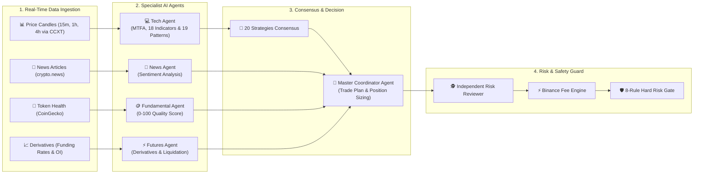
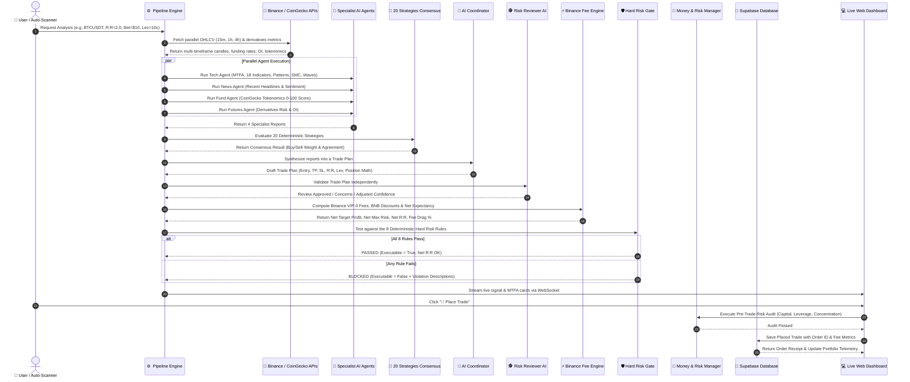

# 🤖 Quantum AI Crypto Trading Engine — System Information & Architecture Guide

> **Guide**: *Imagine you are running a high-tech mission control room for trading cryptocurrencies. Instead of one human trying to read thousands of charts, news articles, and price tickers every second, a team of specialized AI robots works together as your expert advisors, guarded by an unbreakable digital safety lock and a strict financial risk controller.*

---

## 📚 Table of Contents
1. [What is This System? (The Big Picture)](#1-what-is-this-system-the-big-picture)
2. [Key Concepts Made Simple](#2-key-concepts-made-simple)
3. [The "Team of Experts": Multi-Agent AI Architecture](#3-the-team-of-experts-multi-agent-ai-architecture)
4. [The 7-Step Journey of a Trade Signal](#4-the-7-step-journey-of-a-trade-signal)
5. [Multi-Timeframe Analysis (MTFA) Demystified](#5-multi-timeframe-analysis-mtfa-demystified)
6. [The 18 Technical Indicators Explained](#6-the-18-technical-indicators-explained)
7. [10 Macro Patterns & 9 Candlestick Patterns](#7-10-macro-patterns--9-candlestick-patterns)
8. [Smart Money Concepts (SMC / ICT) & Elliott Wave Theory](#8-smart-money-concepts-smc--ict--elliott-wave-theory)
9. [The 20 Deterministic Strategies & Consensus Math](#9-the-20-deterministic-strategies--consensus-math)
10. [The Unbreakable Digital Shield: The 8 Risk Rules](#10-the-unbreakable-digital-shield-the-8-risk-rules)
11. [Money & Risk Management Demystified](#11-money--risk-management-demystified)
12. [System Blueprint & Directory Map](#12-system-blueprint--directory-map)
13. [The Web Dashboard, Risk Control Center & User Experience](#13-the-web-dashboard-risk-control-center--user-experience)
14. [Summary Cheat Sheet & FAQ](#14-summary-cheat-sheet--faq)

---

## 1. What is This System? (The Big Picture)

The **Multi-Agent AI Crypto Trading & Market Analysis Engine** is an automated, real-time computer software system written in **Python 3.11+**. Its purpose is to monitor cryptocurrency markets (such as Bitcoin, Ethereum, and Solana) 24/7, analyze real-time market data across multiple time horizons (`15m`, `1h`, `4h`), coordinate specialist AI agents, test strategy consensus, calculate exact exchange fees, enforce money management rules, and calculate precise, risk-guarded trade setups.

### 🌟 Real-World Analogy: The Formula 1 Racing Team
Think of this system like a world championship **Formula 1 Racing Team**:
* **The Telemetry Sensors (CCXT, Binance & CoinGecko APIs)** measure the car's tire pressure, engine temperature, track humidity, and lap speed in real time across multiple intervals (`15m`, `1h`, `4h`).
* **The Specialist Engineers (Specialist AI Agents)** each focus on one discipline:
  * *Telemetry Engineer*: Multi-timeframe chart indicators and candlestick formations.
  * *Weather Forecaster*: Breaking news sentiment and macroeconomic catalysts.
  * *Chassis Inspector*: Token fundamental health and developer activity.
  * *Tire & Fuel Strategist*: Futures open interest, funding rates, and liquidation risk.
* **The Chief Race Strategist (Master Trading Coordinator AI)** gathers all specialist reports, reviews the user's risk appetite, and drafts an optimal race and pit-stop strategy.
* **The Pit-Stop Accountant (Binance Fee Engine)** calculates the exact fuel costs and tire wear (exchange fees, BNB discounts, and slippage) to ensure the pit stop won't cost more than the race victory payout.
* **The Chief Safety Inspector (LLM Risk Reviewer AI & 8-Rule Hard Risk Gate)** has ultimate veto power: if any safety parameter is violated (engine overheating, crash probability, negative mathematical expectancy), the race plan is **instantly blocked** to protect capital.
* **The Financial Controller (Money & Risk Manager)** tracks bankroll equity, allocates exact betting sizes via the Kelly Criterion, prevents over-leveraging, and logs every lap to the persistent database.
* **The Driver's Cockpit Dashboard (FastAPI & WebSockets)** streams live glowing telemetry dials, portfolio risk meters, and interactive execution buttons to the team boss (you!).

```mermaid
flowchart TD
    A["🌍 Real-Time Market Ingestion<br/>(Binance Spot/Futures via CCXT, CoinGecko, crypto.news)"] --> B["⏱️ Multi-Timeframe Engine<br/>(15m Trigger, 1h Setup, 4h Macro Trend)"]
    B --> C["🤖 Specialist AI Team<br/>(Tech, News, Fundamentals, Derivatives)"]
    C --> D["🎯 20 Strategies Consensus Engine<br/>(Requires 60% Weight & >= 5 Agreeing)"]
    D --> E["🧠 Master Coordinator AI<br/>(Entry, TP, SL, R:R, Safe Leverage)"]
    E --> F["🕵️ Independent Risk Reviewer<br/>(Devil's Advocate AI Validation)"]
    F --> G["⚡ Binance Fee Engine<br/>(VIP-0 Fees, BNB Discounts, Net Expectancy)"]
    G --> H["🛡️ Hard Risk Gate Guard<br/>(8 Deterministic Code-Level Safety Rules)"]
    H -->|Passed (All 8 Rules OK)| I["🚀 Executable Signal & Interactive Order Modal"]
    H -->|Blocked (Violations Found)| J["🛑 Blocked Signal (Logs Reasons for Safety)"]
    I --> K["💼 Money & Risk Management Audit<br/>(Capital, Kelly Sizing, Exposure Caps)"]
    K --> L["💾 Database Recording & Execution"]
```

---

## 2. Key Concepts Made Simple

Here are simple, clear explanations of key trading and crypto concepts:

| Term | Plain English Explanation | Real-Life Comparison |
|---|---|---|
| **Cryptocurrency** | Digital money secured by cryptography (e.g., BTC, ETH, SOL). | Digital tokens or digital gold traded on open global markets. |
| **Spot Market** | Buying the actual underlying coin. You only make a profit if the price goes **UP**. | Buying a physical collector's item and holding it until its price rises. |
| **Perpetual Futures** | A derivatives contract enabling you to profit whether the price goes **UP** (Long) or **DOWN** (Short). | Placing a contract on whether tomorrow's temperature will be higher or lower. |
| **Buy / Long** | Opening a position expecting the market price to **increase**. | Buying inventory before high demand season. |
| **Sell / Short** | Opening a position expecting the market price to **decrease**. | Borrowing an item to sell at $60, buying it back at $20, and keeping the $40 difference. |
| **Leverage (e.g., 5x, 10x)** | Multiplying your position size using borrowed funds. | Riding a bicycle (1x) vs. driving a turbocharged racecar (10x). Speed multiplies, but mistakes are magnified! |
| **Margin / Bet Amount** | The actual cash collateral of your own money placed on a single trade (e.g., $10 USD). | Your cash deposit in a transaction. |
| **Position Size** | Total purchasing power of the trade ($\text{Margin} \times \text{Leverage}$). | Putting down a $10 deposit to control a $100 piece of equipment at 10x leverage. |
| **Maker vs. Taker Fees** | Fees charged by the exchange. Maker adds liquidity (limit orders), Taker takes liquidity (market orders). | Wholesale discount (Maker) vs. retail convenience fee (Taker). |
| **BNB Fee Discount** | Binance discounts fees by 25% (Spot) and 10% (Futures) when paying fees in BNB token. | Using a loyalty rewards card at checkout for instant cash discounts. |
| **Execution Slippage** | The slight price difference between when an order is submitted and when it fills. | Ordering a cab that estimates $10.00 but ends up costing $10.02 due to traffic. |
| **Fee Drag %** | The percentage of your gross profits that gets eaten up by exchange trading fees. | Income tax taken out of your paycheck. |
| **Net vs. Gross Profit** | Gross Profit is your raw market gain. Net Profit is what you actually keep after subtracting all exchange fees. | Revenue vs. Take-home profit after all expenses. |
| **Fixed Fractional Sizing** | Risking a fixed percentage of your total bankroll (e.g. 1% or 2%) on each trade. | Never wagering more than $20 out of a $1,000 savings account on a single turn. |
| **Kelly Criterion** | A famous mathematical formula that calculates the optimal bet percentage to maximize long-term wealth without going broke. | A smart GPS for your betting money that tells you exactly how much gas to give. |
| **Risk-to-Reward (R:R)** | Comparing how much money you risk losing vs. how much you stand to gain (e.g., 1:2 or 1:3). | Risking $5 of lunch money to potentially gain $15. |
| **Multi-Timeframe Analysis** | Checking 3 different zoom levels (`15m`, `1h`, `4h`) to ensure the big picture and small picture agree. | Checking regional weather, track temperature, and immediate cloud cover before racing. |
| **Liquidation** | In futures trading, if the market moves too far against your position, the exchange closes it to prevent debt. | An automatic game over when your health bar hits zero. |
| **Funding Rate** | Periodic fee exchanged between Long and Short traders to keep futures prices tethered to spot prices. | A balancing fee paid between people betting up vs. down. |
| **Open Interest (OI)** | Total number of outstanding active futures contracts that have not been settled. | Total number of active tickets in play across an entire arena. |
| **Maximum Drawdown (DD%)** | The largest percentage drop from a peak in your account balance to a trough. | The deepest valley you drove through on a mountain road trip. |

---

## 3. The "Team of Experts": Multi-Agent AI Architecture

The system splits market analysis across **specialized autonomous AI agents** that operate concurrently before a centralized coordinator synthesizes the final trade plan:



### 1. 📊 The Technical Analysis Agent (`agents/tech_agent.py`)
* **Role**: The "Chart Scientist".
* **What it does**: Analyzes multi-timeframe candle data (`15m`, `1h`, `4h`), computes 18 mathematical indicators, scans 10 macro chart patterns, detects 9 Japanese candlestick pattern categories, analyzes SMC/ICT order flow, and verifies Elliott Wave impulse legs.
* **Output**: A comprehensive technical breakdown, timeframe metrics, detected patterns, and an overall bias: `BULLISH`, `BEARISH`, or `NEUTRAL`.

### 2. 📰 The Market News & Sentiment Agent (`agents/news_agent.py` & `crawler.py`)
* **Role**: The "News Detective".
* **What it does**: Continuously monitors news feeds (via RSS feeds and sitemaps), stores articles in the Supabase database, and evaluates the sentiment of recent headlines using AI.
* **Output**: A sentiment score from `-1.0` (panic) to `+1.0` (euphoria) with key headline summaries.

### 3. 🪙 The Fundamental Analysis Agent (`agents/fund_agent.py` & `fundamentals.py`)
* **Role**: The "Tokenomics Auditor".
* **What it does**: Inspects CoinGecko data to score the underlying token's health (0 to 100).
* **Metrics It Evaluates**: Market Cap Rank, Volume-to-MC Ratio, Fully Diluted Valuation (FDV) inflation, and GitHub developer commit activity.
* **Output**: A fundamental score out of 100 with tokenomics insights.

### 4. ⚡ The Futures Derivatives Agent (`agents/futures_agent.py`)
* **Role**: The "Crowd & Liquidity Watcher".
* **What it does**: Analyzes professional derivatives metrics directly from Binance Futures (8h Funding Rate, 24h Open Interest change, Long/Short ratio, and liquidation distance).
* **Output**: Identifies crowd positioning traps and calculates safe leverage recommendations.

### 5. 🧠 The Master Trading Coordinator (`agents/coordinator.py`)
* **Role**: The "Chief Race Strategist".
* **What it does**: Collates all specialist reports, evaluates the strategy consensus, incorporates user risk settings, and computes exact trade geometry: Entry, Take-Profit, Stop-Loss, Gross R:R, and safe leverage.

### 6. 🕵️ The Independent Risk Reviewer (`agents/risk_reviewer.py`)
* **Role**: The "Devil's Advocate".
* **What it does**: An independent AI agent that inspects the Coordinator's trade draft. It checks for cross-agent contradictions (e.g., "Why go long if sentiment is in extreme fear and funding is overheated?").

---

## 4. The 7-Step Journey of a Trade Signal

The complete lifecycle of how raw market data transforms into an executable, risk-guarded trade:



---

## 5. Multi-Timeframe Analysis (MTFA) Demystified

### Why Look at 3 Timeframes?
Looking at only a single 1-hour chart is like driving while only looking 5 meters in front of your bumper. You might miss a giant storm on the horizon or a sharp nail right under your wheel. 

The system analyzes **3 distinct lenses simultaneously**:

```text
┌────────────────────────────────────────────────────────────────────────────────────────┐
│                        ⏱️ THE 3-TIMEFRAME CONFLUENCE PYRAMID                           │
├──────────────────────┬────────────────────────┬────────────────┬───────────────────────┤
│ Timeframe            │ Role                   │ Weight         │ Trading Function      │
├──────────────────────┼────────────────────────┼────────────────┼───────────────────────┤
│ 4h (Higher TF)       │ Macro Trend Filter     │ 40% Weight     │ Overall market tide   │
│ 1h (Primary TF)      │ Intermediate Setup     │ 40% Weight     │ Core trade geometry   │
│ 15m (Lower TF)       │ Precision Trigger      │ 20% Weight     │ Exact entry timing    │
└──────────────────────┴────────────────────────┴────────────────┴───────────────────────┘
```

### Confluence Status Categories:
1. **`FULL_CONFLUENCE` ($\ge 85\%$ alignment with HTF and LTF confirmation)**:
   * All three timeframes agree in the same direction.
   * **Reward**: Automatically boosts the trade's confidence score by **+10%** (`+0.10`).
2. **`STRONG_CONFLUENCE` ($\ge 65\%$ alignment)**:
   * Clear multi-timeframe directional agreement.
   * **Reward**: Boosts confidence by **+6%** (`+0.06`).
3. **`MODERATE` ($45\% - 64\%$ alignment)**:
   * Mixed or sideways readings across timeframes.
   * **Result**: Neutral (0% adjustment).
4. **`CONFLICTING` ($< 45\%$ alignment)**:
   * Shorter timeframe is fighting against the higher timeframe macro trend.
   * **Penalty**: Incurs an automatic **-10% penalty** (`-0.10`) and attaches a caution warning.

---

## 6. The 18 Technical Indicators Explained

The technical engine computes 18 institutional indicators on every analysis cycle:

| Indicator | Code Function | What it Measures | Interpretation & Signals |
|---|---|---|---|
| **EMA Crossover** | `compute_ema` | Trend direction | Fast EMA (12) crossing above Slow EMA (26) is **BULLISH**; below is **BEARISH**. |
| **SMA** | `compute_sma` | Macro baseline trend | Price above SMA (50) indicates an uptrend; below indicates a downtrend. |
| **RSI** | `compute_rsi` | Momentum & exhaustion | RSI > 70 is Overbought; RSI < 30 is Oversold. Above 50 is bullish momentum. |
| **MACD** | `compute_macd` | Momentum acceleration | MACD line crossing above Signal line or Histogram > 0 is **BULLISH**. |
| **Bollinger Bands** | `compute_bollinger_bands` | Volatility & mean reversion | Price touching lower band signals potential bounce; upper band signals reversal. |
| **Support & Resistance** | `compute_support_resistance` | Key price inflection levels | Computes Pivot Point, S1/S2 support levels, and R1/R2 resistance levels. |
| **RSI Divergence** | `compute_rsi_divergence` | Reversal divergence | Regular Bullish (price lower low + RSI higher low) and Bearish divergence. |
| **Stochastic Oscillator** | `compute_stochastic` | Cycle turning points | %K crossing above %D in oversold zone (<20) is **BULLISH**; >80 is **BEARISH**. |
| **ATR (Average True Range)** | `compute_atr` | Market volatility | Measures average price range per candle for volatility-adjusted stop-loss sizing. |
| **VWAP** | `compute_vwap` | Volume-weighted benchmark | Price above VWAP shows institutional buying premium; below shows discount. |
| **Supertrend** | `compute_supertrend` | Dynamic trend following | ATR-based trailing stop band. Green band under price = **BULLISH**; Red band above = **BEARISH**. |
| **Keltner Channels & Squeeze** | `compute_keltner_channels` | Volatility squeeze breakout | Bollinger Bands narrowing inside Keltner Channel identifies an explosive squeeze breakout. |
| **On-Balance Volume (OBV)** | `compute_obv` | Institutional volume flow | Cumulative volume confirmed against 20 EMA. OBV > 20 EMA signals accumulation. |
| **Ichimoku Cloud** | `compute_ichimoku` | Trend, momentum & cloud support | Price above Kumo Cloud with Tenkan >= Kijun signals strong **BULLISH** trend. |
| **ADX (+DI / -DI)** | `compute_adx` | Trend strength filter | ADX > 25 indicates strong trending market. +DI > -DI is bullish; -DI > +DI is bearish. |
| **Money Flow Index (MFI)** | `compute_mfi` | Volume-weighted RSI | MFI < 20 indicates extreme institutional oversold; MFI > 80 indicates overbought. |
| **Parabolic SAR** | `compute_parabolic_sar` | Trailing stop & reverse | Trailing dots flipping below price indicate **BULLISH** momentum. |
| **Fair Value Gap (FVG)** | `compute_fvg` | 3-candle liquidity imbalance | Identifies unfilled order flow gaps where price expanded with high speed. |

---

## 7. 10 Macro Patterns & 9 Candlestick Patterns

### 10 Macro Chart Patterns
1. **Double Top**: Two consecutive price peaks at similar resistance levels (Bearish reversal).
2. **Double Bottom**: Two consecutive price troughs at similar support levels (Bullish reversal).
3. **Head & Shoulders**: Higher peak (head) flanked by two lower peaks (shoulders) (Bearish reversal).
4. **Inverse Head & Shoulders**: Lower trough (head) flanked by two higher troughs (Bullish reversal).
5. **Ascending Triangle**: Flat resistance ceiling with rising support higher lows (Bullish continuation).
6. **Descending Triangle**: Flat support floor with declining resistance lower highs (Bearish continuation).
7. **Symmetrical Triangle**: Converging support and resistance lines (Breakout imminent).
8. **Rising Wedge**: Converging rising trendlines (Bearish reversal).
9. **Falling Wedge**: Converging falling trendlines (Bullish reversal).
10. **Bull Flag**: Sharp impulsive rally followed by slight downward consolidation (Bullish continuation).

### 9 Japanese Candlestick Patterns
1. **Doji**: Standard Doji (indecision), Dragonfly Doji (bullish rejection), Gravestone Doji (bearish rejection).
2. **Hammer & Hanging Man**: Bullish Hammer (long lower wick after downtrend), Inverted Hammer, Hanging Man, Shooting Star.
3. **Marubozu**: Bullish / Bearish Marubozu (≥90% real candle body showing overwhelming conviction).
4. **Engulfing**: Bullish Engulfing (green body engulfs previous red) / Bearish Engulfing.
5. **Harami**: Bullish / Bearish Harami (small candle body contained inside prior large candle).
6. **Piercing Line & Dark Cloud Cover**: 2-candle patterns with >50% penetration into prior candle body.
7. **Tweezers**: Tweezer Top (matching highs) and Tweezer Bottom (matching lows).
8. **Star Patterns**: Morning Star (3-candle bullish reversal) and Evening Star (3-candle bearish reversal).
9. **Three Soldiers & Crows**: Three White Soldiers (3 strong green candles) and Three Black Crows (3 strong red candles).

---

## 8. Smart Money Concepts (SMC / ICT) & Elliott Wave Theory

### Smart Money Concepts & ICT
The engine implements institutional order-flow mechanics in [`market_structure.py`](file:///c:/Users/acer/Desktop/My%20Project/my-ai-crypto-bot/market_structure.py):
* **Symmetric Swing Pivots**: Confirmed swing highs and swing lows requiring completed candles on both sides.
* **Break of Structure (BOS)**: Price closing beyond previous swing high/low in the direction of the prevailing trend.
* **Change of Character (ChoCH)**: Price closing beyond the opposing swing level, indicating structural trend change.
* **Liquidity Sweeps**: Price briefly piercing a swing extreme to trigger stop-orders before reversing back into range.
* **Order Blocks (OB)**: Tracking active, mitigated, or invalidated institutional supply/demand zones.
* **Optimal Trade Entry (OTE)**: Fibonacci retracement zone between **62% (0.62) and 79% (0.79)** of the dealing range.
* **UTC Kill-Zones**: London Kill-Zone (07:00–10:00 UTC), New York Kill-Zone (12:00–15:00 UTC), Asia Session (00:00–05:00 UTC).

### Deterministic Elliott Wave Theory
Validates 5-wave impulse structures ($1 \to 2 \to 3 \to 4 \to 5$) against Elliott's **3 unbreakable hard rules**:
1. **Rule 1 (Wave 2 Origin)**: Wave 2 never retraces more than 100% of Wave 1 origin.
2. **Rule 2 (Wave 3 Length)**: Wave 3 is never the shortest impulse wave among Waves 1, 3, and 5.
3. **Rule 3 (Wave 4 Overlap)**: Wave 4 never enters the price territory of Wave 1.
4. **Progressive Extremes**: Confirms progressive price extension across Wave 3 and Wave 5.
5. **Fibonacci Projections**: Wave 3 target (1.618x Wave 1), Wave 5 target (0.618x / 1.0x Wave 1), with explicit invalidation price levels.

---

## 9. The 20 Deterministic Strategies & Consensus Math

In [`strategies.py`](file:///c:/Users/acer/Desktop/My%20Project/my-ai-crypto-bot/strategies.py), 20 distinct quantitative strategies are evaluated:

```text
1.  EMA_Crossover         11. SMC_ICT_Confluence
2.  RSI_Reversal          12. Elliott_Wave
3.  MACD_Momentum         13. Supertrend
4.  Bollinger_Bounce      14. Keltner_Squeeze
5.  Trend_Confluence      15. OBV_Flow
6.  Divergence_Breakout   16. Ichimoku_Cloud
7.  Stochastic_Reversal   17. ADX_Trend
8.  ATR_Breakout          18. MFI_Reversal
9.  VWAP_Mean_Reversion   19. Parabolic_SAR
10. Pattern_Breakout      20. FVG_Rebalance
```

### Consensus Engine Voting Mechanism:
1. Each strategy emits a `StrategySignal` (`BUY_LONG`, `SELL_SHORT`, or `HOLD`) with a confidence score (e.g., 0.55 to 0.85).
2. The consensus engine sums total buy confidence weight vs. sell confidence weight vs. hold weight.
3. To trigger an executable action:
   * **Consensus Weight $\ge$ 60%** of total strategy voting weight.
   * **Minimum Agreeing Strategies $\ge$ 5** agreeing on the direction.
4. If the threshold is not met, the consensus action defaults to `HOLD` with `executable = False`.

---

## 10. The Unbreakable Digital Shield: The 8 Risk Rules

Located in [`risk_gate.py`](file:///c:/Users/acer/Desktop/My%20Project/my-ai-crypto-bot/risk_gate.py), the Hard-Risk Gate is a deterministic code-level barrier with **zero AI involvement**:

```text
┌────────────────────────────────────────────────────────────────────────────────────────┐
│                        🛡️ THE 8 HARD-RISK RULES & PROTECTION MATRIX                    │
├────────────────────────────────────────────────────────────────────────────────────────┤
│ RULE 1: Direction Alignment    │ Spot trades cannot be SELL_SHORT. Spot is long-only.  │
├────────────────────────────────┼───────────────────────────────────────────────────────┤
│ RULE 2: RSI Boundary Guard     │ Block BUY_LONG if RSI > 75.0 (prevents buying tops).  │
│                                │ Block SELL_SHORT if RSI < 25.0 (prevents shorting dip)│
├────────────────────────────────┼───────────────────────────────────────────────────────┤
│ RULE 3: Stochastic Guard       │ Block BUY_LONG if %K > 85.0 (overbought rejection).   │
│                                │ Block SELL_SHORT if %K < 15.0 (oversold bounce risk). │
├────────────────────────────────┼───────────────────────────────────────────────────────┤
│ RULE 4: Minimum Gross R:R      │ Trade MUST achieve at least 1.5:1 (or user target R:R)│
│                                │ reward-to-risk ratio.                                 │
├────────────────────────────────┼───────────────────────────────────────────────────────┤
│ RULE 5: Strict Price Order     │ Longs must satisfy: Stop-Loss < Entry < Take-Profit.  │
│                                │ Shorts must satisfy: Take-Profit < Entry < Stop-Loss. │
├────────────────────────────────┼───────────────────────────────────────────────────────┤
│ RULE 6: Futures Liquidation    │ 6a. Leverage cannot exceed MAX_ALLOWED_LEVERAGE (500x)│
│         & Derivatives Guard    │ 6b. Liquidation price must be >= 15.0% away from entry│
│                                │     and strictly beyond the Stop-Loss price.          │
│                                │ 6c. Block trades betting against extreme funding rate.│
├────────────────────────────────┼───────────────────────────────────────────────────────┤
│ RULE 7: HOLD Safety Guard      │ HOLD decisions are never marked executable.           │
├────────────────────────────────┼───────────────────────────────────────────────────────┤
│ RULE 8: Binance Fee & Net      │ 8a. Net Risk-to-Reward ratio must be >= 1.80 : 1      │
│         Expectancy Guard       │ 8b. Net Expected Value (EV) must be positive (> $0)   │
│                                │ 8c. Fee drag cannot consume > 25% of gross profit.    │
└────────────────────────────────────────────────────────────────────────────────────────┘
```

---

## 11. Money & Risk Management Demystified

### Why Capital Management Beats Prediction
In trading, you can have a 70% win rate and still go completely broke if you risk too much on the 30% of trades that lose. The system's **Money Risk Manager** (`risk_manager.py`) ensures you survive losing streaks and compound gains safely:

1. **Fixed Fractional Position Sizing**:
   * Instead of guessing how much to bet, the system works backwards from your **Stop-Loss distance**:
   * If your account is **$10,000** and you set a **2% risk ($200)**:
     * If the Stop-Loss is **2% away**, your total position size is $\frac{\$200}{0.02} = \$10,000$.
     * At **10x leverage**, your required margin deposit is just **$1,000**.
     * If Stop-Loss hits, you lose **exactly $200 (2%)**—never more!

2. **The Kelly Criterion Formula**:
   * The system calculates the optimal fraction of your bankroll to wager based on historical win rates and payout ratios:
   * **Half-Kelly** is used as the safe institutional standard to prevent excessive volatility while maximizing geometric growth.

3. **Exchange Fee Protection & Fee Traps**:
   * On Binance Futures, fees are charged on the **leveraged position size**, not your margin deposit.
   * If you trade with high leverage on small price moves, exchange fees can silently eat all your profits.
   * The **Fee Engine** tests every trade before execution. If fees consume more than **25% of the gross profit**, the trade is flagged and blocked as a **Fee Trap**.

4. **Pre-Trade 8-Point Audit**:
   * Before placing an order, the system checks:
     1. Is the action legal on this market?
     2. Are Stop-Loss and Take-Profit in valid mathematical order?
     3. Have we reached the maximum number of concurrent open positions (e.g. 5)?
     4. Are we already holding 2 trades in this specific coin?
     5. Do we have enough available cash margin?
     6. Does this new trade breach our total portfolio leverage cap (e.g. 10x)?
     7. Does the dollar risk exceed our risk budget?
     8. Is the Net R:R at least 1.8:1 after all Binance fees and slippage?

---

## 12. System Blueprint & Directory Map

```text
my-ai-crypto-bot/
├── main.py               # 🚀 Application Launcher & CLI Single-Shot Runner
├── server.py             # 🌐 FastAPI Web Server, Auth APIs, WebSocket Streamer & UI
├── pipeline.py           # 🔄 Master Pipeline Orchestrator (Multi-TF data coordination)
├── risk_manager.py       # 💼 Money & Risk Management Engine (Position sizing, Kelly, Risk audit)
├── fee_calculator.py     # ⚡ Binance VIP-0 Fees, BNB Discounts, Slippage & Net Expectancy
├── risk_gate.py          # 🛡️ Hard-Coded 8-Rule Safety Gate Guard
├── config.py             # ⚙️ Settings, Risk Thresholds, Fee Rates, MTFA Config, Monitored Coins
├── models.py             # 📋 Pydantic v2 Data Models (TradeSignal, PlacedTrade, PortfolioMetrics)
├── database.py           # 💾 Supabase Cloud Database Manager (Articles, Signals, Trades)
├── ccxt_client.py        # 📡 CCXT Binance Market Data Client (Spot, Futures, Parallel TFs)
├── indicators.py         # 📐 18 Indicators, 10 Macro Patterns, 9 Candlestick Detectors, MTFA
├── market_structure.py   # 🏛️ Deterministic SMC/ICT & Elliott Wave Impulse Analyzer
├── fundamentals.py       # 🪙 CoinGecko Scraper & 0-100 Fundamental Health Scorer
├── crawler.py            # 🕷️ Async News Scraper (crypto.news RSS & Sitemap Discovery)
├── strategies.py         # 🎯 20 Deterministic Strategies & Consensus Engine
├── schema.sql            # 🗄️ Supabase PostgreSQL schema definitions (articles, signals, trades)
├── requirements.txt      # 📦 Project Python dependencies
├── agents/               # 🤖 Specialist AI Agents
│   ├── __init__.py       # Package init
│   ├── ai_utils.py       # 🧹 Robust JSON Extractor & Prompt Text Cleaner
│   ├── coordinator.py    # 🧠 Master Trading Coordinator Agent
│   ├── tech_agent.py     # 📊 Technical Chart Analysis Agent (MTFA-enabled)
│   ├── news_agent.py     # 📰 News Sentiment Analysis Agent
│   ├── fund_agent.py     # 🪙 Fundamental Quality Agent
│   ├── futures_agent.py  # ⚡ Futures Derivatives Agent
│   └── risk_reviewer.py  # 🕵️ Independent Risk Review Agent
└── tests/                # 🧪 Automated Test Suite (57 Passing Tests)
    ├── __init__.py
    ├── test_regressions.py   # 41 Multi-agent, MTFA, indicator, model & system regression tests
    ├── test_fee_calculator.py # 8 Binance fee, BNB discount & net expectancy unit tests
    └── test_risk_manager.py   # 8 Position sizing, Kelly criterion & risk audit unit tests
```

---

## 13. The Web Dashboard, Risk Control Center & User Experience

The web dashboard (`server.py`) provides an interactive command center directly in your web browser:

1. **🔒 Secure Authentication**: Protected with username and password verification configured via `.env`.
2. **🎛️ Dual-Tab Navigation Bar**:
   - **Market Signals Tab**: Real-time scanner, multi-agent signal cards, search bar, and trade placement.
   - **Money & Risk Management Tab**: Portfolio capital telemetry, dynamic position sizing calculator, placed trades database table, manual position closure, and risk limit settings.
3. **⚡ Real-Time WebSocket Streaming (`/ws`)**: Price movements, scan updates, trade executions, and news crawler alerts stream without page refreshes.
4. **📊 6-Column Portfolio Risk Telemetry**: Live dials displaying Account Balance, Available Margin, Margin Utilization %, Open Risk Exposure ($ and %), Net Realized PnL, Win Rate %, Net Profit Factor, Kelly Sizing %, and Fee Drag %.
5. **Dynamic Position Sizing Calculator**: Interactive risk sliders, symbol pickers, leverage selection, and BNB fee deduction toggle for instant mathematical previews.
6. **Placed Trades Database Table**: Real-time search, status filtering (`OPEN`, `CLOSED`, `TP_HIT`, `SL_HIT`), and one-click manual close modal with live net PnL calculations.
7. **🎯 Interactive "Place Trade" Modal**: Review multi-timeframe confirmation cards (`15m`, `1h`, `4h`), confluence badges, and execute orders with pre-trade risk verification.
8. **🔬 Deep Dive Inspection Modal**: Inspect technical indicator values, macro chart patterns, fundamental tokenomics, news headlines, and risk reviewer feedback for any coin.

---

## 14. Summary Cheat Sheet & FAQ

* **What programming language is used?** Python 3.11+ with FastAPI, Pydantic v2, and CCXT.
* **What AI models are supported?** NVIDIA NIM (`nvidia/nemotron-3.5-lightning-30b-a3b` default via OpenAI-compatible SDK) and Anthropic Claude (`claude-sonnet-4-20250514`), with automatic fallback to deterministic math if no API key is set.
* **How does Multi-Timeframe Analysis work?** It evaluates `15m`, `1h`, and `4h` timeframes simultaneously, requiring alignment between the macro trend (4h) and trigger (15m) before applying confidence boosts.
* **How are exchange fees handled?** Binance VIP-0 Maker/Taker fees, BNB deduction discounts (25% Spot, 10% Futures), and 0.02% slippage are modeled on every trade to compute true Net Expectancy.
* **Where does market data come from?** Binance (Spot & USD-M Futures) via CCXT, CoinGecko for fundamental metrics, and crypto.news for RSS news feeds.
* **Where is data stored?** Supabase cloud database (`articles`, `signals`, and `trades` tables).
* **How many strategies and tests exist?** 20 distinct quantitative strategies and **57 automated unit & regression tests** (100% passing).
* **How do I launch the platform?**
  ```bash
  # 1. Start the Web Dashboard
  python main.py

  # 2. Or run a single analysis in your terminal
  python main.py --cli-only --symbol BTCUSDT --market SPOT
  ```

---
*Created for the Multi-Agent AI Crypto Trading System. Designed to be modular, robust, educational, and mathematically safe!*
