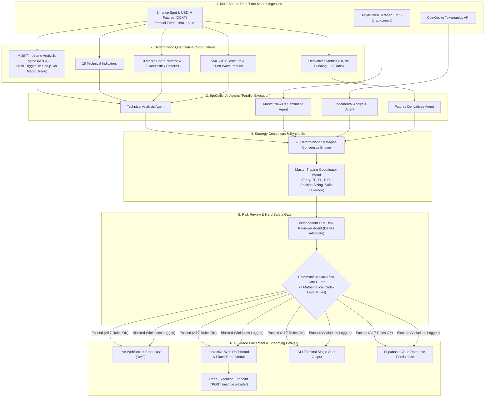

# 🤖 Multi-Agent AI Crypto Trading & Market Analysis Engine

[](https://www.python.org/downloads/)
[](https://fastapi.tiangolo.com)
[](https://www.nvidia.com/en-us/ai-data-science/products/nim/)
[](https://supabase.com)
[](LICENSE)

A production-grade, asynchronous, multi-agent cryptocurrency market analysis and trade signal generation platform written in Python. The system analyzes both **Spot** (long-only) and **Perpetual Futures** (long/short with leverage) markets using real-time market data, **Multi-Timeframe Analysis (MTFA)** across `15m`, `1h`, and `4h` candles, 18 technical indicators, 10 macro chart patterns, 9 Japanese candlestick patterns, Smart Money Concepts (SMC / ICT), Elliott Wave impulse theory, fundamental tokenomics, news sentiment analysis, and futures derivatives metrics.

Featuring a secured embedded **real-time WebSocket Web Dashboard** with `.env` authentication, an interactive **Trade Placement & Execution Modal**, and a **CLI Analysis Tool**, the engine orchestrates specialist AI agents, runs deterministic consensus across 20 trading strategies, enforces strict hard-coded risk management gates, and streams live executable trade signals.

---

## 📑 Table of Contents

- [🌟 Key Features](#-key-features)
- [📁 System Architecture & Directory Structure](#-system-architecture--directory-structure)
- [📊 High-Level Flowchart & Signal Lifecycle](#-high-level-flowchart--signal-lifecycle)
- [🧠 Multi-Agent AI System Breakdown](#-multi-agent-ai-system-breakdown)
- [⏱️ Multi-Timeframe Analysis (MTFA) Engine](#️-multi-timeframe-analysis-mtfa-engine)
- [📊 Technical Analysis, SMC/ICT & Elliott Wave Engine](#-technical-analysis-smcict--elliott-wave-engine)
- [🎯 20 Deterministic Strategies & Consensus Engine](#-20-deterministic-strategies--consensus-engine)
- [🛡️ Deterministic Hard-Risk Gate Guard (7 Rules)](#️-deterministic-hard-risk-gate-guard-7-rules)
- [🚀 Quick Start & Installation](#-quick-start--installation)
- [💻 Usage Guide](#-usage-guide)
  - [1. Web Dashboard Server](#1-run-web-dashboard-server)
  - [2. Interactive Trade Placement Modal](#2-interactive-trade-placement-modal)
  - [3. CLI Single-Shot Runner](#3-run-cli-single-shot-analysis)
- [🔌 API & WebSocket Documentation](#-api--websocket-documentation)
- [⚙️ Configuration Reference](#️-configuration-reference)
- [🧪 Testing & Quality Assurance](#-testing--quality-assurance)
- [⚠️ Disclaimer](#️-disclaimer)

---

## 🌟 Key Features

- **🔒 Dashboard Authentication & Security**:
  - Secured web interface with credentials configured via `.env` (`DASHBOARD_USERNAME` & `DASHBOARD_PASSWORD`).
  - Sleek, dark glassmorphism Login Overlay with password toggle, persistent session state (`sessionStorage`), session verification endpoint (`/api/verify-session`), and one-click **Logout**.

- **🧠 Multi-Agent AI Architecture**:
  - **Technical Analysis Agent**: Evaluates multi-timeframe trends, 18 indicators, 10 macro patterns, 9 candlestick patterns, SMC/ICT structures, and Elliott Waves.
  - **Market News Agent**: Scrapes and analyzes real-time sentiment from news streams using RSS/sitemap feeds.
  - **Fundamental Analysis Agent**: Scores token metrics, FDV, market cap, supply ratios, and developer commits via CoinGecko.
  - **Futures Derivatives Agent**: Evaluates 8h funding rates, open interest trends, long/short account ratios, and liquidation buffers.
  - **Trading Coordinator Agent**: Synthesizes inputs and user risk parameters into executable trade plans with position sizing math.
  - **LLM Risk Reviewer Agent**: Independent "devil's advocate" AI validating trade logic, checking contradictions, and adjusting confidence.
  - **Dual LLM Provider Support**: Native integration with NVIDIA NIM (`nvidia/nemotron-3.5-lightning-30b-a3b` default) and Anthropic Claude (`claude-sonnet-4-20250514`), with automatic fallback to deterministic math if no API key is provided.

- **⏱️ Multi-Timeframe Analysis Engine (MTFA)**:
  - Synchronous parallel fetching and analysis across **3 concurrent timeframes**:
    - **4h (Higher Timeframe / Macro Trend Filter)**: 40% weighting.
    - **1h (Intermediate Timeframe / Primary Setup)**: 40% weighting.
    - **15m (Lower Timeframe / Execution Trigger)**: 20% weighting.
  - Generates confluence status classifications: `FULL_CONFLUENCE` (+10% confidence boost), `STRONG_CONFLUENCE` (+6% boost), `MODERATE` (neutral), `CONFLICTING` (-10% penalty), and `UNAVAILABLE`.

- **🎯 Interactive Trade Placement & Execution**:
  - Click any actionable signal card to open the interactive **"Place Trade" Modal**.
  - Visualizes complete position sizing calculations: Margin Bet ($), Leverage Multiplier, Total Position Size ($), Max Risk at Stop-Loss (-$Risk), Target Profit (+$Profit), and Estimated ROI (`est_roi_pct`).
  - Renders live Multi-Timeframe Cards (`15m`, `1h`, `4h`) displaying individual Bias, Trend, and RSI values alongside a Confluence Badge.
  - Simulates or dispatches trade orders via `POST /api/place-trade` with instant order receipt generation.

- **📊 Comprehensive Technical, Market Structure & Candlestick Engine**:
  - **18 Technical Indicators**: EMA Crossovers, SMA, RSI, MACD, Bollinger Bands, Support/Resistance Pivot Points, RSI Divergence, Stochastic Oscillator (%K/%D), ATR, VWAP, Supertrend, Keltner Channels & Squeeze, On-Balance Volume (OBV), Ichimoku Cloud, ADX (+DI/-DI), Money Flow Index (MFI), Parabolic SAR, and Fair Value Gaps (FVG).
  - **10 Macro Chart Patterns**: Double Top, Double Bottom, Head & Shoulders, Inverse Head & Shoulders, Ascending Triangle, Descending Triangle, Symmetrical Triangle, Rising Wedge, Falling Wedge, Bull Flag.
  - **9 Japanese Candlestick Patterns**: Doji (Standard, Dragonfly, Gravestone), Hammer / Inverted Hammer / Hanging Man / Shooting Star, Marubozu (Bullish/Bearish), Engulfing (Bullish/Bearish), Harami (Bullish/Bearish), Piercing Line & Dark Cloud Cover, Tweezers (Top/Bottom), Star Patterns (Morning Star/Evening Star), Three White Soldiers & Three Black Crows.
  - **SMC / ICT Structure**: Swing liquidity pools and sweeps, BOS / ChoCH events, Order Blocks, Fair Value Gaps, Premium/Discount zones, Optimal Trade Entry (OTE 62%-79%), and UTC session kill-zones (London, New York, Asia).
  - **Elliott Wave**: Deterministic 1-2-3-4-5 impulse validation, strict hard-rule verification (W2 > W1 origin, W3 not shortest, W4 no overlap W1, progressive extremes), Fibonacci retracements/extensions, invalidation levels, and RSI momentum confirmation.

- **🎯 20 Deterministic Strategies & Consensus Engine**:
  - Executes 20 distinct quantitative strategies and computes confidence-weighted voting.
  - Requires a **60% majority consensus** and at least **5 agreeing strategies** before generating trade signals.

- **🛡️ Deterministic Hard-Risk Gate Guard (7 Rules)**:
  - Strict code-level mathematical safety rules with **zero LLM involvement**.
  - Enforces direction alignment, RSI bounds (>75 overbought, <25 oversold), Stochastic bounds (>85 / <15), minimum Risk-to-Reward ratio floor, strict price ordering (SL < Entry < TP or TP < Entry < SL), maximum leverage caps, liquidation distance buffers (≥15%), and extreme funding rate protections.

- **🪙 Memecoin Symbol Normalization**:
  - Automatic futures contract symbol translation for Binance derivatives (e.g., `PEPEUSDT` $\to$ `1000PEPEUSDT`, `SHIBUSDT` $\to$ `1000SHIBUSDT`, `FLOKI`, `BONK`, `LUNC`, etc.).

- **⚡ Real-Time WebSocket Web Dashboard**:
  - Modern Single Page Application (SPA) with dark glassmorphism UI built with Tailwind CSS.
  - Real-time WebSocket streaming feed (`/ws`) broadcasting price updates, scan results, multi-timeframe reports, and multi-agent summaries.
  - Interactive risk controls: target minimum R:R ratio, margin bet amount ($10 USD default), and leverage multiplier.
  - Live instant search across Top 50 monitored cryptocurrency pairs.
  - Modal inspection popups displaying technical summaries, fundamental scores, sentiment breakdowns, derivatives metrics, and risk reviewer feedback.

- **💾 Supabase Cloud Database Persistence**:
  - Cloud database integration via `supabase-py` for persisting news articles, full-text search indexing, and historical trade signals.

---

## 📁 System Architecture & Directory Structure

```text
my-ai-crypto-bot/
├── main.py               # Application launcher & CLI single-shot runner
├── server.py             # FastAPI web server, Auth APIs, WebSocket manager & dashboard UI
├── pipeline.py           # Master orchestration pipeline (create_trade_plan & MTFA fetch)
├── risk_gate.py          # Deterministic 7-rule hard risk gate guard
├── config.py             # Global settings, API endpoints, MTFA thresholds, risk parameters
├── models.py             # Pydantic v2 data schemas & blueprints for signals, MTFA & reports
├── database.py           # Supabase cloud database manager (articles & signals)
├── crawler.py            # Async web scraper for crypto news (RSS & sitemaps)
├── ccxt_client.py        # CCXT market data client (Multi-TF parallel fetching & Binance Futures)
├── indicators.py         # 18 Indicators, 10 Macro Patterns, 9 Candlestick Detectors, MTFA Engine
├── market_structure.py   # Deterministic SMC/ICT & Elliott Wave impulse analysis
├── fundamentals.py       # CoinGecko metrics scraper & fundamental health scorer (0-100)
├── strategies.py         # 20 Deterministic trading strategies & Consensus Engine
├── schema.sql            # PostgreSQL / Supabase table definitions
├── requirements.txt      # Python dependencies
├── agents/               # Specialist AI Agents
│   ├── __init__.py       # Package initialization
│   ├── ai_utils.py       # Robust JSON extractor & text cleaner (handles thinking tags)
│   ├── coordinator.py    # Master Trading Coordinator Agent
│   ├── tech_agent.py     # Technical Analysis Agent (multi-timeframe aware)
│   ├── news_agent.py     # Market News & Sentiment Agent
│   ├── fund_agent.py     # Fundamental Analysis Agent
│   ├── futures_agent.py  # Futures Derivatives Agent
│   └── risk_reviewer.py  # Independent LLM Risk Review Agent
└── tests/                # Automated test suite
    ├── __init__.py
    └── test_regressions.py # 39 Comprehensive regression & unit tests
```

---

## 📊 High-Level Flowchart & Signal Lifecycle



---

## 🧠 Multi-Agent AI System Breakdown

The architecture deploys specialist agents that analyze distinct market dimensions concurrently before a coordinator drafts the trade plan:

| Agent | Module | Primary Responsibilities | Data Sources / Tools |
|---|---|---|---|
| **Technical Analysis Agent** | [`agents/tech_agent.py`](file:///c:/Users/acer/Desktop/My%20Project/my-ai-crypto-bot/agents/tech_agent.py) | Computes multi-timeframe reports (15m, 1h, 4h), 18 indicators, scans 10 macro patterns and 9 candlestick patterns, evaluates SMC/ICT structures and Elliott Waves, runs strategy consensus. | Binance OHLCV via CCXT, `indicators.py`, `market_structure.py`, `strategies.py` |
| **Market News & Sentiment Agent** | [`agents/news_agent.py`](file:///c:/Users/acer/Desktop/My%20Project/my-ai-crypto-bot/agents/news_agent.py) | Analyzes recent news articles, scores sentiment from `-1.0` (panic) to `+1.0` (euphoria), and extracts major catalysts. | Supabase article database, `crawler.py` (crypto.news RSS/sitemaps) |
| **Fundamental Analysis Agent** | [`agents/fund_agent.py`](file:///c:/Users/acer/Desktop/My%20Project/my-ai-crypto-bot/agents/fund_agent.py) | Evaluates tokenomics, FDV ratio, market cap rank, volume/MC ratio, circulating supply, and GitHub commits (0-100 score). | CoinGecko API v3, `fundamentals.py` |
| **Futures Derivatives Agent** | [`agents/futures_agent.py`](file:///c:/Users/acer/Desktop/My%20Project/my-ai-crypto-bot/agents/futures_agent.py) | Monitors 8h funding rates, 24h Open Interest change %, Long/Short account ratios, liquidation distance buffers, and crowd traps. | Binance Futures REST (`fapi/v1`) & CCXT |
| **Trading Coordinator Agent** | [`agents/coordinator.py`](file:///c:/Users/acer/Desktop/My%20Project/my-ai-crypto-bot/agents/coordinator.py) | Synthesizes all agent reports, incorporates user risk inputs (target R:R, margin bet $, leverage), calculates entry/TP/SL and position sizing math. | All specialist reports, `models.py` |
| **LLM Risk Reviewer Agent** | [`agents/risk_reviewer.py`](file:///c:/Users/acer/Desktop/My%20Project/my-ai-crypto-bot/agents/risk_reviewer.py) | Independent validator acting as a "devil's advocate"; inspects cross-agent contradictions, adjusts confidence, and flags discrepancies. | Coordinator Draft + Specialist Reports |

---

## ⏱️ Multi-Timeframe Analysis (MTFA) Engine

The engine performs comprehensive multi-timeframe analysis across 3 simultaneous horizons to eliminate false breakouts and confirm macro alignment:


### Timeframe Roles & Weights:
1. **4h Timeframe (`HTF_MACRO` - 40% weight)**: Filters counter-trend setups by assessing the overarching macro trend and key high-timeframe support/resistance zones.
2. **1h Timeframe (`PRIMARY_SETUP` - 40% weight)**: Serves as the primary operational chart for indicator confluence, chart patterns, and SMC/ICT structure.
3. **15m Timeframe (`LTF_TRIGGER` - 20% weight)**: Pinpoints precision entry timing, immediate candlestick triggers, and short-term momentum alignment.

### Dynamic Confidence Adjustments:
- When all 3 timeframes align (`FULL_CONFLUENCE`), the signal confidence score receives an automatic **+10% boost** (`+0.10`).
- Strong multi-timeframe alignment (`STRONG_CONFLUENCE`) yields a **+6% boost** (`+0.06`).
- Opposing or fractured timeframe signals (`CONFLICTING`) incur a **-10% penalty** (`-0.10`) and log cautionary warnings.

---

## 📊 Technical Analysis, SMC/ICT & Elliott Wave Engine

### 1. 18 Technical Indicators
1. **EMA Crossover**: Fast (12) vs. Slow (26) Exponential Moving Average trend detection.
2. **SMA**: 50-period Simple Moving Average trend baseline.
3. **RSI**: 14-period Relative Strength Index with Wilder's smoothing.
4. **MACD**: 12/26/9 MACD line, signal line, and histogram momentum crossovers.
5. **Bollinger Bands**: 20-period SMA ± 2.0 std dev with dynamic bandwidth calculation.
6. **Support & Resistance**: Pivot Point calculation with S1/S2 and R1/R2 levels.
7. **RSI Divergence**: Regular Bullish (price lower low + RSI higher low) and Bearish (price higher high + RSI lower high) divergence detection.
8. **Stochastic Oscillator**: 14,3,3 %K and %D with overbought/oversold boundaries.
9. **ATR**: 14-period Average True Range for volatility measuring and stop-loss sizing.
10. **VWAP**: 20-period Volume-Weighted Average Price benchmark.
11. **Supertrend**: ATR-based dynamic trailing volatility bands (period 10, multiplier 3.0).
12. **Keltner Channels & Squeeze**: EMA (20) ± 1.5 ATR with Bollinger Band squeeze breakout detection.
13. **On-Balance Volume (OBV)**: Cumulative volume flow confirmed against a 20-period EMA.
14. **Ichimoku Cloud**: Tenkan (9), Kijun (26), Senkou Span A/B (52) Kumo cloud analysis.
15. **ADX (+DI / -DI)**: 14-period Average Directional Index with directional trend filters.
16. **Money Flow Index (MFI)**: 14-period volume-weighted RSI for institutional money flow.
17. **Parabolic SAR**: Dynamic stop-and-reverse trailing indicator (step 0.02, max 0.20).
18. **Fair Value Gap (FVG)**: 3-candle imbalance detector (Bullish / Bearish FVG).

### 2. 10 Macro Chart Patterns
1. **Double Top** (Bearish reversal)
2. **Double Bottom** (Bullish reversal)
3. **Head & Shoulders** (Bearish reversal)
4. **Inverse Head & Shoulders** (Bullish reversal)
5. **Ascending Triangle** (Bullish continuation)
6. **Descending Triangle** (Bearish continuation)
7. **Symmetrical Triangle** (Bilateral breakout)
8. **Rising Wedge** (Bearish reversal)
9. **Falling Wedge** (Bullish reversal)
10. **Bull Flag** (Bullish continuation)

### 3. 9 Japanese Candlestick Patterns
1. **Doji**: Standard Doji, Dragonfly Doji (Bullish), Gravestone Doji (Bearish).
2. **Hammer & Hanging Man**: Bullish Hammer, Inverted Hammer, Bearish Hanging Man, Shooting Star.
3. **Marubozu**: Bullish Marubozu, Bearish Marubozu (≥90% real body).
4. **Engulfing**: Bullish Engulfing, Bearish Engulfing (2-candle sequence).
5. **Harami**: Bullish Harami, Bearish Harami (inside candle).
6. **Piercing Line & Dark Cloud Cover**: 2-candle >50% penetration patterns.
7. **Tweezers**: Tweezer Top (Bearish) and Tweezer Bottom (Bullish).
8. **Star Patterns**: Morning Star (Bullish) and Evening Star (Bearish) (3-candle sequence).
9. **Three Soldiers & Crows**: Three White Soldiers (Bullish) and Three Black Crows (Bearish).

### 4. Smart Money Concepts (SMC / ICT)
- **Confirmed Swing Pivots**: Symmetric pivot point detection requiring confirmation on both sides.
- **Market Structure**: Break of Structure (BOS) and Change of Character (ChoCH).
- **Liquidity Pools & Sweeps**: Buy-side / sell-side liquidity sweeps and equal highs/lows resting liquidity.
- **Order Blocks & Fair Value Gaps**: Order block identification with active, mitigated, or invalidated state tracking.
- **Premium / Discount & OTE**: Equilibrium dealing range calculation with Optimal Trade Entry (62% to 79% retracement).
- **UTC Session Killzones**: London (07:00–10:00 UTC), New York (12:00–15:00 UTC), and Asia (00:00–05:00 UTC).

### 5. Deterministic Elliott Wave Analysis
- **Impulse 1-2-3-4-5 Validation**: Validates Elliott's hard rules:
  1. Wave 2 does not retrace below Wave 1 origin.
  2. Wave 3 is not the shortest impulse wave.
  3. Wave 4 does not overlap Wave 1 price territory.
  4. Progressive extremes across impulse legs.
- **Fibonacci Retracements & Extensions**: Wave 3 target (1.618x), Wave 5 target (0.618x / 1.0x), and structural invalidation levels.

---

## 🎯 20 Deterministic Strategies & Consensus Engine

The consensus engine aggregates outputs from 20 quantitative strategies using confidence-weighted voting:

| # | Strategy Name | Signal Conditions | Default Weight / Confidence |
|---|---|---|---|
| 1 | **EMA_Crossover** | Fast EMA (12) vs. Slow EMA (26) crossover | 0.65 |
| 2 | **RSI_Reversal** | RSI < 30 (Oversold Buy) or RSI > 70 (Overbought Sell) | 0.70 |
| 3 | **MACD_Momentum** | MACD line vs. Signal line and Histogram zero-cross | 0.60 |
| 4 | **Bollinger_Bounce** | Price touches or crosses outer Bollinger Bands | 0.60 |
| 5 | **Trend_Confluence** | Confluence agreement across EMA + MACD + RSI | 0.55 – 0.85 |
| 6 | **Divergence_Breakout** | Regular RSI Bullish / Bearish divergence | 0.70 |
| 7 | **Stochastic_Reversal** | %K / %D crossovers in oversold (<20) / overbought (>80) zones | 0.60 |
| 8 | **ATR_Breakout** | High volatility expansion (ATR > 3%) with directional EMA | 0.60 |
| 9 | **VWAP_Mean_Reversion** | Price deviation below/above Volume-Weighted Average Price | 0.55 |
| 10 | **Pattern_Breakout** | Validated macro chart pattern breakout | 0.60 – 0.75 |
| 11 | **SMC_ICT_Confluence** | Structural break + liquidity sweep + OB / FVG / OTE confluence | 0.65 – 0.80 |
| 12 | **Elliott_Wave** | Rule-validated 1-5 impulse wave in active impulsive phase | 0.60 – 0.85 |
| 13 | **Supertrend** | Price vs. ATR dynamic band support/resistance crossover | 0.75 |
| 14 | **Keltner_Squeeze** | Bollinger Band squeeze inside Keltner Channel and channel breakout | 0.70 |
| 15 | **OBV_Flow** | On-Balance Volume trend vs. 20-period EMA accumulation | 0.65 |
| 16 | **Ichimoku_Cloud** | Price breakout above/below Kumo Cloud with Tenkan/Kijun cross | 0.75 |
| 17 | **ADX_Trend** | ADX > 25 with +DI > -DI (Bullish) or -DI > +DI (Bearish) | 0.70 |
| 18 | **MFI_Reversal** | Volume-weighted Money Flow Index oversold (<20) or overbought (>80) | 0.65 |
| 19 | **Parabolic_SAR** | Parabolic SAR trailing dots flip below/above price | 0.65 |
| 20 | **FVG_Rebalance** | Fair Value Gap imbalance fill and rejection | 0.70 |

### Consensus Math:
$$\text{Buy Weight} = \sum_{\text{signals}=\text{BUY}} \text{Confidence}_i, \quad \text{Sell Weight} = \sum_{\text{signals}=\text{SELL}} \text{Confidence}_i$$
$$\text{Consensus Requirement} = (\text{Weight Pct} \ge 60\%) \land (\text{Agreeing Strategies} \ge 5)$$

---

## 🛡️ Deterministic Hard-Risk Gate Guard (7 Rules)

Regardless of agent consensus or AI recommendations, `risk_gate.py` evaluates every signal against **7 strict mathematical rules**. If any rule fails, the signal is marked `executable = False` and violations are recorded:

```text
┌────────────────────────────────────────────────────────────────────────────────────────┐
│                        🛡️ THE 7 UNBREAKABLE HARD-RISK RULES                             │
├────────────────────────────────────────────────────────────────────────────────────────┤
│ RULE 1: Direction Alignment    │ Spot markets must NEVER issue SELL_SHORT signals.     │
├────────────────────────────────┼───────────────────────────────────────────────────────┤
│ RULE 2: RSI Boundary Guard     │ Block BUY_LONG if RSI > 75.0 (Extreme Overbought).    │
│                                │ Block SELL_SHORT if RSI < 25.0 (Extreme Oversold).    │
├────────────────────────────────┼───────────────────────────────────────────────────────┤
│ RULE 3: Stochastic Guard       │ Block BUY_LONG if %K > 85.0 (Stochastic Overbought).  │
│                                │ Block SELL_SHORT if %K < 15.0 (Stochastic Oversold).  │
├────────────────────────────────┼───────────────────────────────────────────────────────┤
│ RULE 4: Minimum R:R Threshold  │ Reward-to-Risk ratio must meet max(1.5, target_min_rr)│
├────────────────────────────────┼───────────────────────────────────────────────────────┤
│ RULE 5: Strict Price Order     │ Long trades require: Stop-Loss < Entry < Take-Profit  │
│                                │ Short trades require: Take-Profit < Entry < Stop-Loss │
├────────────────────────────────┼───────────────────────────────────────────────────────┤
│ RULE 6: Futures Liquidation    │ 6a. Leverage cannot exceed MAX_ALLOWED_LEVERAGE (500x)│
│         & Derivatives Guard    │ 6b. Liquidation distance must be >= 15.0% from Entry  │
│                                │     and must remain beyond the Stop-Loss price.       │
│                                │ 6c. Block trades against extreme funding rates (>0.05%)│
├────────────────────────────────┼───────────────────────────────────────────────────────┤
│ RULE 7: HOLD Safety Guard      │ Neutral / HOLD signals are NEVER marked executable.   │
└────────────────────────────────────────────────────────────────────────────────────────┘
```

---

## 🚀 Quick Start & Installation

### Prerequisites
- **Python 3.11+** installed
- Optional: NVIDIA NIM API Key or Anthropic API Key (system gracefully falls back to deterministic analysis if omitted)
- Optional: Supabase Cloud credentials for cloud database persistence

### 1. Clone & Set Up Environment

```bash
git clone <repository-url>
cd my-ai-crypto-bot

# Create a virtual environment
python -m venv venv

# Activate virtual environment
# On Windows:
venv\Scripts\activate
# On Linux/macOS:
source venv/bin/activate

# Install dependencies
pip install -r requirements.txt
```

### 2. Configure Environment Variables

Create a `.env` file in the root directory:

```env
# ─── AI Provider Configuration (nvidia or anthropic) ──────────────────────────
AI_PROVIDER=nvidia

# NVIDIA NIM API (Primary)
NVIDIA_API_KEY=your-nvidia-api-key-here
NVIDIA_MODEL=nvidia/nemotron-3.5-lightning-30b-a3b

# Anthropic Claude API (Fallback / Optional)
ANTHROPIC_API_KEY=your-anthropic-api-key-here
CLAUDE_MODEL=claude-sonnet-4-20250514

# ─── Supabase Cloud Database ──────────────────────────────────────────────────
SUPABASE_URL=https://your-project.supabase.co
SUPABASE_KEY=your-supabase-anon-or-service-key

# ─── Web Server & Dashboard Authentication ────────────────────────────────────
SERVER_HOST=0.0.0.0
SERVER_PORT=8000
DASHBOARD_USERNAME=admin
DASHBOARD_PASSWORD=your-secure-password

# ─── Background Scanner & Market Settings ─────────────────────────────────────
SCAN_INTERVAL=60
COINGECKO_API_KEY=your-coingecko-api-key-optional
```

---

## 💻 Usage Guide

### 1. Run Web Dashboard Server

Launch the application with the Uvicorn web server hosting the FastAPI REST API and real-time WebSocket dashboard:

```bash
python main.py
```
Or directly with Uvicorn:
```bash
uvicorn server:app --host 0.0.0.0 --port 8000
```

Open your browser and navigate to:
👉 **`http://localhost:8000`**

1. Enter your credentials (`DASHBOARD_USERNAME` & `DASHBOARD_PASSWORD` from `.env`).
2. Click **Unlock Dashboard** to access the live market control center.
3. Features:
   - **Real-Time Scanning**: Live price and signal updates across Top 10 default / Top 50 total cryptocurrency pairs.
   - **Interactive Risk Sizing**: Adjust Target R:R (e.g., 2.0x, 3.0x), Margin Bet Amount (e.g., $10 USD default), and Leverage Multiplier.
   - **Live Instant Search**: Search any coin pair on demand with immediate feedback.
   - **Multi-Agent Deep Dive**: Click any signal card to open a modal inspection window detailing indicator values, candlestick patterns, fundamental tokenomics, news sentiment, and risk reviewer feedback.
   - **News Scraper Controls**: Trigger on-demand news crawls and view stored articles.
   - **Logout**: Lock the control center at any time.

---

### 2. Interactive Trade Placement Modal

Click the glowing **"🎯 Place Trade"** button on any executable signal card to launch the trade execution modal:

- **Mathematical Position Breakdown**:
  - **Entry, Take-Profit, and Stop-Loss Prices**
  - **Risk-to-Reward Ratio ($R:R$)**
  - **Margin Bet Amount ($)** vs. **Total Position Size ($)**
  - **Max Dollar Risk at Stop-Loss** and **Target Profit Goal**
  - **Estimated Return on Investment (`est_roi_pct`)**
- **Multi-Timeframe Status Cards**:
  - `15m` Card: Lower Timeframe Entry Trigger bias, trend, and RSI.
  - `1h` Card: Intermediate Primary Setup bias, trend, and RSI.
  - `4h` Card: Higher Timeframe Macro Filter bias, trend, and RSI.
  - **Confluence Badge**: Displays overall confluence % and validation status (`FULL_CONFLUENCE`, `STRONG_CONFLUENCE`, etc.).
- **Order Execution & Receipts**:
  - Click **"🎯 Confirm & Place Trade"** to execute order placement via `/api/place-trade`.
  - Instantly generates an order receipt displaying `Order ID`, `Position Size`, `Leverage`, and `Timestamp`.

---

### 3. Run CLI Single-Shot Analysis

Run a comprehensive single-shot market analysis directly in your terminal:

```bash
# Basic Spot analysis for Bitcoin
python main.py --cli-only --symbol BTCUSDT --market SPOT

# Futures analysis for Ethereum with custom risk parameters
python main.py --cli-only --symbol ETHUSDT --market FUTURES --min-rr 2.5 --trade-amount 50 --leverage 10
```

#### CLI Command Options:
- `--cli-only`: Run a single analysis and exit.
- `--symbol`: Trading symbol (e.g., `BTCUSDT`, `ETHUSDT`, `SOLUSDT`). Default: `BTCUSDT`.
- `--market`: Market type (`SPOT` or `FUTURES`). Default: `SPOT`.
- `--min-rr`: Minimum target Risk-to-Reward ratio (e.g., `2.0`, `3.0`). Default: `2.0`.
- `--trade-amount`: Margin bet amount in USD (e.g., `10.0`, `100.0`). Default: `10.0`.
- `--leverage`: Leverage multiple for Futures trades (e.g., `5`, `10`, `20`). Default: auto-suggested.

---

## 🔌 API & WebSocket Documentation

### REST API Endpoints

| Method | Endpoint | Description | Query / Body Parameters |
|---|---|---|---|
| `GET` | `/` | Embedded Single-Page Web Dashboard | None |
| `POST` | `/api/login` | Authenticate dashboard user | `{ "username": "admin", "password": "..." }` |
| `POST` | `/api/verify-session` | Verify active session token | `{ "token": "..." }` |
| `GET` | `/api/analyze` | Trigger instant single-pair analysis | `symbol`, `market`, `min_rr`, `trade_amount`, `leverage` |
| `POST` | `/api/start-analysis` | Start continuous market scanner | `{ "trade_amount": 10.0, "min_rr": 2.0, "leverage": 10 }` |
| `POST` | `/api/stop-analysis` | Stop running background scanner | None |
| `POST` | `/api/place-trade` | Place simulated / live trade execution order | `{ "symbol": "BTCUSDT", "market_type": "FUTURES", "action": "BUY_LONG", "entry_price": 65000, "take_profit": 68000, "stop_loss": 63500, "trade_amount_usd": 10.0, "leverage": 10, "timeframes_analyzed": ["15m", "1h", "4h"], "mtf_confluence_score": 85.0, "mtf_status": "FULL_CONFLUENCE" }` |
| `GET` | `/api/report/details` | Retrieve full multi-agent report for modal | `symbol`, `market` |
| `POST` | `/api/crawl` | Trigger on-demand news crawler | None |
| `GET` | `/api/articles` | Retrieve stored news articles from Supabase | `limit`, `query` |
| `GET` | `/api/signals` | Retrieve historical trade signals | `symbol`, `limit` |
| `GET` | `/api/symbols` | Get Top 10 and Top 50 monitored coin lists | None |

### WebSocket Endpoint (`/ws`)

Connect via `ws://localhost:8000/ws` for real-time bi-directional messaging:

- **Server-to-Client Messages**:
  - `SNAPSHOT`: Sent immediately on connection containing latest scan reports and coin lists.
  - `SIGNAL_UPDATE`: Broadcast whenever an updated analysis report or trade signal is generated.
  - `NEWS_UPDATE`: Broadcast when new articles are crawled and stored.
  - `ANALYSIS_STARTED` / `ANALYSIS_STOPPED`: Broadcast when scanner state changes.

- **Client-to-Server Messages**:
  - `TRIGGER_SCAN`: Trigger an immediate analysis on a specific pair with custom risk inputs:
    ```json
    {
      "action": "TRIGGER_SCAN",
      "symbol": "SOLUSDT",
      "market": "FUTURES",
      "min_rr": 2.5,
      "trade_amount": 25.0,
      "leverage": 10
    }
    ```

---

## ⚙️ Configuration Reference

Key configurable parameters in [`config.py`](file:///c:/Users/acer/Desktop/My%20Project/my-ai-crypto-bot/config.py):

| Parameter | Default Value | Description |
|---|---|---|
| `AI_PROVIDER` | `"nvidia"` | Selected AI provider (`"nvidia"` or `"anthropic"`) |
| `NVIDIA_MODEL` | `"nvidia/nemotron-3.5-lightning-30b-a3b"` | NVIDIA NIM LLM model identifier |
| `CLAUDE_MODEL` | `"claude-sonnet-4-20250514"` | Anthropic Claude LLM model identifier |
| `MTF_TIMEFRAMES` | `["15m", "1h", "4h"]` | Analyzed timeframes for Multi-Timeframe Analysis |
| `MTF_PRIMARY_TIMEFRAME` | `"1h"` | Primary intermediate setup timeframe |
| `MTF_HTF_TIMEFRAME` | `"4h"` | Higher timeframe macro trend filter |
| `MTF_LTF_TIMEFRAME` | `"15m"` | Lower timeframe execution trigger |
| `MTF_CONFIRMATION_BOOST_MAX` | `0.10` | Maximum confidence boost (+10%) for multi-timeframe confluence |
| `DEFAULT_MIN_RR` | `2.0` | Default minimum Risk-to-Reward ratio |
| `DEFAULT_TRADE_AMOUNT_USD` | `$10.0` | Default user margin bet amount per trade |
| `DEFAULT_LEVERAGE` | `10x` | Default leverage for perpetual futures |
| `MAX_ALLOWED_LEVERAGE` | `500x` | System maximum leverage cap |
| `MIN_LIQUIDATION_DISTANCE` | `15.0%` | Minimum liquidation distance buffer |
| `RSI_OVERBOUGHT` / `OVERSOLD` | `75.0` / `25.0` | Hard risk RSI blocking boundaries |
| `STOCH_OVERBOUGHT` / `OVERSOLD` | `85.0` / `15.0` | Hard risk Stochastic %K blocking boundaries |
| `EXTREME_FUNDING_RATE` | `±0.05%` | 8h funding rate limit blocking contrarian trades |
| `CONSENSUS_THRESHOLD` | `60.0%` | Strategy consensus weight required for signal |
| `MIN_STRATEGIES_AGREE` | `5` | Minimum agreeing strategies required |
| `SCAN_INTERVAL_SECONDS` | `60s` | Interval for background scanner cycles |
| `DASHBOARD_USERNAME` | `"admin"` | Web dashboard login username |
| `DASHBOARD_PASSWORD` | `"..."` | Web dashboard login password |

---

## 🧪 Testing & Quality Assurance

The codebase includes an automated regression and integration test suite in [`tests/test_regressions.py`](file:///c:/Users/acer/Desktop/My%20Project/my-ai-crypto-bot/tests/test_regressions.py) containing **39 comprehensive tests** covering:
- **Multi-Timeframe Analysis (MTFA)**: Single-timeframe metrics extraction, 3-timeframe confluence scoring, status determination, and dashboard dictionary serialization.
- **Mathematical Stability**: Indicator resilience and finite output validation during flat/zero-volatility market conditions.
- **Data Integrity**: Rejection of malformed kline data structures and error boundary protections.
- **Smart Money Concepts (SMC / ICT)**: Fair Value Gap bounds preservation and order block zone calculations.
- **Elliott Wave Impulse Theory**: Deterministic 1-2-3-4-5 impulse validation, hard-rule checks, and Fibonacci extensions.
- **Specialist Agent Integration**: Technical agent reporting, multi-timeframe inclusion, and consensus model formatting.
- **Dual LLM Provider Dispatching**: Async mock dispatch tests for NVIDIA NIM and Anthropic Claude across all specialist agents.
- **Hard Risk Gate Enforcement**: Direction alignment, liquidation distance guards, price ordering rules, leverage caps, and HOLD safety.
- **Server Authentication & Orders**: Login credential verification, session token persistence, and `/api/place-trade` request validation.
- **AI Utility Robustness**: JSON extraction resilience against reasoning/thinking tags and markdown fences.
- **Pydantic Model Validation**: DataFrame truthiness error prevention in trade plan orchestration.

Run the test suite:
```bash
python -m unittest discover tests
```

---

## ⚠️ Disclaimer

This software is for **educational, analytical, and research purposes only**. It does **not** constitute financial, investment, or trading advice. Cryptocurrency trading—particularly involving perpetual futures, margin, and leverage—carries substantial risk of financial loss. Always practice strict risk management and do your own research.
