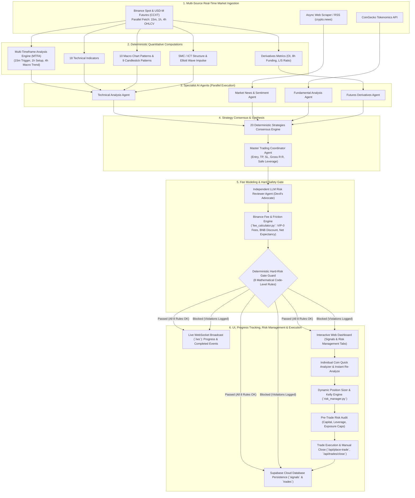
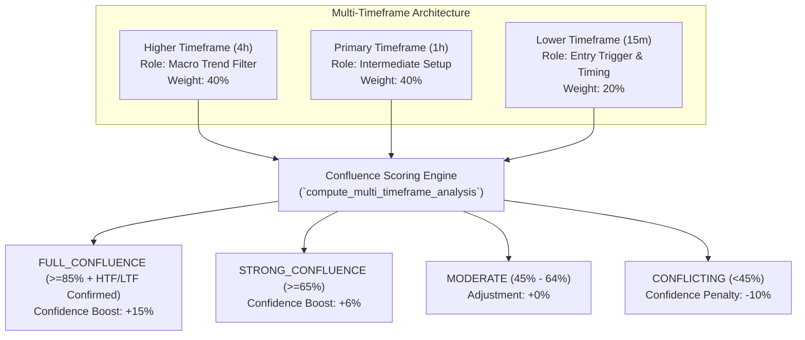

# 🤖 Multi-Agent AI Crypto Trading & Market Analysis Engine

[](https://www.python.org/downloads/)
[](https://fastapi.tiangolo.com)
[](https://www.nvidia.com/en-us/ai-data-science/products/nim/)
[](https://supabase.com)
[](tests/)
[](LICENSE)

A production-grade, asynchronous, multi-agent cryptocurrency market analysis, money risk management, and trade execution platform written in Python 3.11+. The system analyzes both **Spot** (long-only) and **Perpetual Futures** (long/short with leverage up to 500x) markets using real-time market data, **Multi-Timeframe Analysis (MTFA)** across `15m`, `1h`, and `4h` candles, 18 technical indicators, 10 macro chart patterns, 9 Japanese candlestick patterns, Smart Money Concepts (SMC / ICT), Elliott Wave impulse theory, fundamental tokenomics, news sentiment analysis, and futures derivatives metrics.

Featuring an institutional-grade **Money & Risk Management Control Center**, an interactive **Individual Coin Quick Analyzer**, a **Real-Time Scan Progress & Completion System**, **Binance VIP-0 Fee & Slippage Friction Engine**, an 8-rule deterministic **Hard-Risk Gate**, an interactive **Trade Placement & Execution Modal**, a persistent **Placed Trades Database**, and a secured **Real-Time WebSocket Web Dashboard** with `.env` authentication, the engine orchestrates specialist AI agents, runs deterministic consensus across 20 quantitative trading strategies, and ensures long-term positive mathematical expectancy net of all exchange fees.

---

## 📑 Table of Contents

- [🌟 Key Features](#-key-features)
- [📁 System Architecture & Directory Structure](#-system-architecture--directory-structure)
- [📊 High-Level Flowchart & Signal Lifecycle](#-high-level-flowchart--signal-lifecycle)
- [🎴 Signal Card Anatomy & Telemetry Guide](#-signal-card-anatomy--telemetry-guide)
- [🧠 Multi-Agent AI System Breakdown](#-multi-agent-ai-system-breakdown)
- [⏱️ Multi-Timeframe Analysis (MTFA) Engine](#️-multi-timeframe-analysis-mtfa-engine)
- [📊 Technical Analysis, SMC/ICT & Elliott Wave Engine](#-technical-analysis-smcict--elliott-wave-engine)
- [🎯 20 Deterministic Strategies & Consensus Engine](#-20-deterministic-strategies--consensus-engine)
- [🛡️ Deterministic Hard-Risk Gate Guard (8 Rules)](#️-deterministic-hard-risk-gate-guard-8-rules)
- [💰 Money & Risk Management & Binance Fee Calculation Engine](#-money--risk-management--binance-fee-calculation-engine)
- [🚀 Quick Start & Installation](#-quick-start--installation)
- [💻 Usage Guide](#-usage-guide)
  - [1. Web Dashboard Server](#1-run-web-dashboard-server)
  - [2. Individual Coin Quick Analyzer & On-Demand Scanning](#2-individual-coin-quick-analyzer--on-demand-scanning)
  - [3. Real-Time Scan Progress & Completion Tracking](#3-real-time-scan-progress--completion-tracking)
  - [4. Money & Risk Management Control Center](#4-money--risk-management-control-center)
  - [5. Interactive Trade Placement & Execution](#5-interactive-trade-placement--execution)
  - [6. CLI Single-Shot Runner](#6-run-cli-single-shot-analysis)
- [🔌 API & WebSocket Documentation](#-api--websocket-documentation)
- [⚙️ Configuration Reference](#️-configuration-reference)
- [🧪 Testing & Quality Assurance](#-testing--quality-assurance)
- [⚠️ Disclaimer](#️-disclaimer)

---

## 🌟 Key Features

- **⚡ Individual Coin Quick Analyzer & Live Progress Bar**:
  - **On-Demand Single-Coin Selector**: Select any coin among Top 50 pairs, choose `BOTH (Spot + Futures)`, `SPOT`, or `FUTURES`, and trigger instant real-time multi-agent analysis with custom risk parameters.
  - **Per-Card Instant Re-Analyze**: Dedicated `⚡ Re-analyze` button on each signal card to refresh analysis on demand with `force_refresh=true`.
  - **Live Scan Progress Bar**: Real-time progress bar streaming % completion and processed pairs count (`ANALYSIS_PROGRESS` WebSocket event).
  - **Analysis Completed Banner & Re-Analyze**: Glowing 100% completion banner with exact completion timestamp and one-click **"🔄 Re-Analyze All 50 Coins"** button (`ANALYSIS_COMPLETED`).
  - **Exact Timestamp & Relative Time Badges**: Every signal card and inspection modal displays exact analysis timestamps (`YYYY-MM-DD HH:MM:SS`) and auto-updating relative time indicators (`just now`, `Xs ago`, `Xm ago`).

- **💼 Money & Risk Management Control Center (`risk_manager.py`)**:
  - **Dynamic Position Sizing**: Fixed Fractional model calculating required notional position size and margin based on total account equity, stop-loss distance %, and risk allocation (e.g. 1–2%).
  - **Kelly Criterion Optimizer**: Computes Full-Kelly, Half-Kelly (safer standard), and Quarter-Kelly mathematical bankroll growth fractions.
  - **Pre-Trade Portfolio Risk Audit**: 8-stage pre-execution safety inspection verifying capital availability, single-trade risk caps, asset concentration limits (max 2 positions per asset), maximum concurrent open positions (default 5), portfolio leverage limits, and net-of-fee R:R hurdles before writing orders to the database.
  - **Comprehensive Portfolio Metrics**: Real-time tracking of margin utilization %, open risk exposure ($ and %), gross vs. net realized PnL, win rate %, net profit factor, maximum drawdown % curve, daily PnL, and cumulative Binance trading fee drag.

- **⚡ Binance Trading Fee, Slippage & Net Expectancy Engine (`fee_calculator.py`)**:
  - Exact exchange friction modeling using Binance VIP-0 Tier fees: Spot (0.10% Maker / 0.10% Taker) and USDⓈ-M Futures (0.02% Maker / 0.05% Taker).
  - Binance BNB fee deduction discounts (25% discount on Spot, 10% discount on Futures).
  - Realistic execution slippage buffer (0.02%) and round-trip commission drag on leveraged notional position sizes.
  - Mathematical Net Expectancy ($EV$), Net Risk-to-Reward (Net R:R $\ge 1.5:1$), Net Est. ROI %, and Fee-Trap filtering to prevent opening trades where exchange commissions consume >25% of gross profits.

- **🛡️ 8 Deterministic Hard-Risk Gate Rules (`risk_gate.py`)**:
  - Code-level mathematical safety rules with **zero LLM involvement**.
  - Enforces direction alignment, RSI bounds (>75 overbought, <25 oversold), Stochastic bounds (>85 / <15), minimum Gross R:R floor, strict price ordering ($SL < Entry < TP$ for Long, $TP < Entry < SL$ for Short), maximum leverage caps (up to 500x), liquidation distance buffers ($\ge 5\%$, supporting safe leverage up to 20x), extreme funding rate protections ($\pm 0.05\%$), HOLD safety, and **Rule 8: Binance Fee & Net Expectancy Guard** (Net R:R $\ge 1.5:1$, $EV > \$0$).

- **🧠 Multi-Agent AI Architecture**:
  - **Technical Analysis Agent**: Evaluates multi-timeframe trends, 18 indicators, 10 macro patterns, 9 candlestick patterns, SMC/ICT structures, and Elliott Waves.
  - **Market News Agent**: Scrapes and analyzes real-time sentiment from news streams using RSS/sitemap feeds.
  - **Fundamental Analysis Agent**: Scores token metrics, FDV, market cap, supply ratios, and developer commits via CoinGecko (0–100 score).
  - **Futures Derivatives Agent**: Evaluates 8h funding rates, open interest trends, long/short account ratios, and liquidation buffers.
  - **Trading Coordinator Agent**: Synthesizes inputs and user risk parameters into executable trade plans with position sizing math.
  - **LLM Risk Reviewer Agent**: Independent "devil's advocate" AI validating trade logic, checking contradictions, and adjusting confidence.
  - **Dual LLM Provider Support**: Native integration with NVIDIA NIM (`nvidia/nemotron-3.5-lightning-30b-a3b` default) and Anthropic Claude (`claude-sonnet-4-20250514`), with automatic fallback to deterministic math if no API key is provided.

- **⏱️ Multi-Timeframe Analysis Engine (MTFA)**:
  - Synchronous parallel fetching and analysis across **3 concurrent timeframes**:
    - **4h (Higher Timeframe / Macro Trend Filter)**: 40% weighting.
    - **1h (Intermediate Timeframe / Primary Setup)**: 40% weighting.
    - **15m (Lower Timeframe / Execution Trigger)**: 20% weighting.
  - Confluence status classifications: `FULL_CONFLUENCE` (+15% confidence boost), `STRONG_CONFLUENCE` (+6% boost), `MODERATE` (neutral), `CONFLICTING` (-10% penalty), and `UNAVAILABLE`.

- **🎯 Interactive Trade Placement & Placed Trades Database**:
  - Click any actionable signal card to launch the **"Place Trade" Modal** with live multi-timeframe cards (`15m`, `1h`, `4h`), analysis timestamp, and confluence badges.
  - Dispatch orders via `POST /api/place-trade`, run pre-trade risk audit, persist records into Supabase `trades` table, and generate instant order receipts.
  - Search, filter, and review placed trades in real time by symbol, market type, status (`OPEN`, `CLOSED`, `TP_HIT`, `SL_HIT`), and keyword.
  - Manual **"Close Position" Modal** with real-time exit price simulation and net realized PnL calculations after deducting entry and exit Binance commissions.

- **📊 Comprehensive Technical, Market Structure & Candlestick Engine**:
  - **18 Technical Indicators**: EMA Crossover, SMA, RSI, MACD, Bollinger Bands, Support/Resistance Pivots, RSI Divergence, Stochastic Oscillator, ATR, VWAP, Supertrend, Keltner Channels & Squeeze, OBV, Ichimoku Cloud, ADX (+DI/-DI), MFI, Parabolic SAR, Fair Value Gaps (FVG).
  - **10 Macro Chart Patterns**: Double Top, Double Bottom, Head & Shoulders, Inverse Head & Shoulders, Ascending Triangle, Descending Triangle, Symmetrical Triangle, Rising Wedge, Falling Wedge, Bull Flag.
  - **9 Candlestick Pattern Families**: Doji, Hammer / Inverted Hammer / Hanging Man / Shooting Star, Marubozu, Engulfing, Harami, Piercing Line & Dark Cloud Cover, Tweezers, Star Patterns, Three Soldiers & Crows.
  - **SMC / ICT & Elliott Wave**: Confirmed swing pivots, BOS/ChoCH, Liquidity sweeps, Order Blocks, Premium/Discount & OTE (62%–79%), UTC session kill-zones, and deterministic 1-2-3-4-5 impulse validation with Fibonacci extensions.

- **🎯 20 Deterministic Strategies & Consensus Engine**:
  - Executes 20 quantitative strategies and computes confidence-weighted voting.
  - Requires **60% majority consensus** and at least **5 agreeing strategies** to trigger signals.

- **⚡ Real-Time WebSocket Web Dashboard**:
  - Dark glassmorphism Single Page Application (SPA) with Tailwind CSS.
  - Navigation switcher between **Market Signals** and **Money & Risk Management** views.
  - Real-time WebSocket feed (`/ws`) broadcasting price snapshots, signal updates, progress bars, trade executions, and news crawler alerts.
  - Interactive risk controls: target R:R, margin bet amount ($10 USD default), and leverage selector (1x to 500x, 10x default).
  - Modal inspection popups for multi-agent deep dives, trade execution, position closure, and risk limit configuration.

- **💾 Supabase Cloud Database Persistence**:
  - PostgreSQL schema with Row-Level Security (RLS) for storing news articles, full-text search indexing, historical trade signals, and live executed trade orders.

---

## 📁 System Architecture & Directory Structure

```text
my-ai-crypto-bot/
├── main.py               # Application launcher & CLI single-shot runner
├── server.py             # FastAPI web server, Auth APIs, WebSocket manager & dashboard UI
├── pipeline.py           # Master orchestration pipeline (create_trade_plan & MTFA fetch)
├── risk_manager.py       # Money & Risk Management Engine (Position sizing, Kelly, Pre-trade audit)
├── fee_calculator.py     # Binance trading fee, BNB discount, slippage & net expectancy engine
├── risk_gate.py          # Deterministic 8-rule hard risk gate guard
├── config.py             # Global settings, API endpoints, fee structures, risk parameters
├── models.py             # Pydantic v2 data schemas (TradeSignal, PlacedTrade, PortfolioMetrics)
├── database.py           # Supabase cloud database manager (articles, signals, and trades)
├── crawler.py            # Async web scraper for crypto news (RSS & sitemaps)
├── ccxt_client.py        # CCXT market data client (Multi-TF parallel fetching & Binance Futures)
├── indicators.py         # 18 Indicators, 10 Macro Patterns, 9 Candlestick Detectors, MTFA Engine
├── market_structure.py   # Deterministic SMC/ICT & Elliott Wave impulse analysis
├── fundamentals.py       # CoinGecko metrics scraper & fundamental health scorer (0-100)
├── strategies.py         # 20 Deterministic trading strategies & Consensus Engine
├── schema.sql            # PostgreSQL / Supabase table definitions (articles, signals, trades)
├── requirements.txt      # Python dependencies
├── agents/               # Specialist AI Agents
│   ├── __init__.py       # Package initialization
│   ├── ai_utils.py       # Robust JSON extractor & text cleaner (handles thinking tags)
│   ├── coordinator.py    # Master Trading Coordinator Agent
│   ├── tech_agent.py     # Technical Analysis Agent (multi-timeframe aware)
│   ├── news_agent.py     # Market News & Sentiment Agent
│   ├── fund_agent.py     # Fundamental Analysis Agent
│   ├── futures_agent.py  # Futures Derivatives Agent
│   └── risk_reviewer.py  # Independent LLM Risk Review Agent
└── tests/                # Automated test suite (60 passing tests)
    ├── __init__.py
    ├── test_regressions.py   # 44 Multi-agent, MTFA, indicator, model & system regression tests
    ├── test_fee_calculator.py # 8 Binance fee, BNB discount & net expectancy unit tests
    └── test_risk_manager.py   # 8 Position sizing, Kelly criterion & risk audit unit tests
```

---

## 📊 High-Level Flowchart & Signal Lifecycle



---

## 🎴 Signal Card Anatomy & Telemetry Guide

Every cryptocurrency pair evaluated by the multi-agent engine renders a rich, interactive glassmorphic signal card on the web dashboard. Below is an exact breakdown of all elements displayed:

```text
┌────────────────────────────────────────────────────────────────────────────────────────┐
│  AVAXUSDT  [FUTURES]                                           [RISK GATE PASSED]      │
├────────────────────────────────────────────────────────────────────────────────────────┤
│  🕒 Analyzed: 2026-08-17 14:43:43                                              2m ago  │
├────────────────────────────────────────────────────────────────────────────────────────┤
│  SIGNAL ACTION                                                             CONFIDENCE  │
│  SELL_SHORT                                                                       90%  │
├────────────────────────────────────────────────────────────────────────────────────────┤
│  🕒 ANALYZED TIMEFRAMES                                              100% Confluence   │
│  [ 🔴 15m BEAR ]                  [ 🔴 1h BEAR ]                 [ 🔴 4h BEAR ]        │
├────────────────────────────────────────────────────────────────────────────────────────┤
│  ENTRY                         TAKE PROFIT                                  STOP LOSS  │
│  $6.33                         $5.96                                            $6.51  │
├────────────────────────────────────────────────────────────────────────────────────────┤
│  POSITION SIZING (USER BET)                                                            │
│  Margin Bet: $10                                                  Pos Size: $100       │
│  Max Risk (SL): -$2.93                                            Target (TP): +$5.86  │
├────────────────────────────────────────────────────────────────────────────────────────┤
│  Gross R:R: 2:1                Net R:R: 1.89:1                                         │
│  Net EV: +$1.34                Leverage: 10x                                           │
│  Sug. Leverage: [ 29x ✨ ]                                                             │
├────────────────────────────────────────────────────────────────────────────────────────┤
│  • Tech: SELL_SHORT (66%)                                                              │
│  • News: BEARISH (-0.50)                                                               │
│  • Fund: 28/100                                                                        │
├────────────────────────────────────────────────────────────────────────────────────────┤
│  [RISK GATE REJECTIONS (Only shown if Blocked)]:                                       │
│  • RULE 7 - HOLD Safety: HOLD signals are never executable                             │
├────────────────────────────────────────────────────────────────────────────────────────┤
│  🔍 Deep Dive                  ⚡ Re-analyze                               🎯 Place Trade  │
└────────────────────────────────────────────────────────────────────────────────────────┘
```

### Detailed Component Field Reference:

| Component / Field | Visual Appearance | What It Represents & How It Is Calculated |
|---|---|---|
| **Symbol & Market Badge** | `AVAXUSDT [FUTURES]` or `DOTUSDT [SPOT]` | The cryptocurrency trading pair and market type (Spot is long-only; Futures supports long/short leverage). Clicking the symbol opens the deep-dive modal. |
| **Risk Gate Status Badge** | `RISK GATE PASSED` (Green) or `RISK GATE BLOCKED` (Red) | Indicates whether the trade successfully passed **all 8 hard-risk safety rules**. Green means the setup is mathematically safe and executable. |
| **Analysis Timestamp Bar** | `Analyzed: 2026-08-17 14:43:43` & `2m ago` | Displays the exact UTC date and time the pair was analyzed, alongside a live relative time indicator that refreshes every 15 seconds. |
| **Signal Action & Confidence** | `SELL_SHORT 90%` or `HOLD 27%` | The synthesised trade direction (`BUY_LONG`, `SELL_SHORT`, or `HOLD`) and consensus confidence percentage (combining strategy weights, agent consensus, and MTFA boosts). |
| **Confluence Badge** | `100% Confluence` or `75% Confluence` | Quantitative agreement score across the 3 analyzed time horizons (`15m`, `1h`, `4h`). |
| **Timeframe Pills (`15m`, `1h`, `4h`)** | `15m BEAR`, `1h BEAR`, `4h BEAR` | Individual bias readings for each timeframe horizon (`BEAR` in red, `BULL` in green, `NEUT` in gray) indicating multi-timeframe alignment. |
| **Entry, TP & SL Prices** | `Entry: $6.33` \| `TP: $5.96` \| `SL: $6.51` | Recommended precise entry price, Take-Profit target (green), and Stop-Loss invalidation price (red) calculated by the AI Coordinator and Technical Engine. |
| **Margin Bet** | `Margin Bet: $10` | The actual dollar collateral of user equity allocated to this single trade setup. |
| **Pos Size (Position Size)** | `Pos Size: $100` | Leveraged notional position purchasing power ($\text{Margin} \times \text{Leverage}$, e.g. $\$10 \times 10 = \$100$). Shows simulated value for HOLD signals. |
| **Max Risk (SL)** | `Max Risk (SL): -$2.93` | Maximum dollar loss incurred if the price drops/rises to hit the Stop-Loss price. |
| **Target (TP)** | `Target (TP): +$5.86` | Gross estimated dollar profit earned if the price reaches the Take-Profit target. |
| **Gross R:R** | `Gross R:R: 2:1` | Raw reward-to-risk ratio before accounting for exchange commissions and slippage. |
| **Net R:R** | `Net R:R: 1.89:1` | True Net Risk-to-Reward ratio after deducting Binance VIP-0 maker/taker trading fees, BNB discounts, and execution slippage. |
| **Net EV (Expected Value)** | `Net EV: +$1.34` | Net mathematical expectancy in USD per trade based on a 50% win rate baseline after exchange friction. Must be positive ($> \$0$) to execute. |
| **Leverage & Fee Drag** | `Leverage: 10x` (Futures) \| `Fee Drag: 0%` (Spot) | Selected leverage multiplier on Futures, or commission drag percentage on Spot. |
| **Sug. Leverage Badge** | `Sug. Leverage: [ 29x ✨ ]` | System-calculated maximum safe leverage keeping liquidation $\ge 5\%$ away and safely beyond Stop-Loss. **Clicking the badge automatically applies it to your controls!** |
| **Specialist Agent Bullets** | `Tech`, `News`, `Fund` summaries | Summarizes the 3 core domain agent outputs: Technical direction and confidence, News sentiment rating and score ($-1.0$ to $+1.0$), and Tokenomics health score ($0$ to $100$). |
| **Risk Gate Rejections** | `• RULE 7 - HOLD Safety: ...` | Visible only on blocked cards; lists the exact code-level safety rule(s) that prevented execution. |
| **`🔍 Deep Dive` Button** | Blue text / icon button | Launches the multi-tab inspection modal containing all 18 indicators, candlestick patterns, SMC zones, Elliott Wave legs, news headlines, and risk reviewer critique. |
| **`⚡ Re-analyze` Button** | Gray action button | Triggers an immediate, live single-coin analysis with cache bypass (`force_refresh=true`) and updates this card in real time. |
| **`🎯 Place Trade` Button** | Glowing green button (Active) \| Gray (Disabled) | Opens the interactive pre-trade execution modal with order confirmation, live risk audit, and Supabase database order logging. |

---

## 🧠 Multi-Agent AI System Breakdown

| Agent | Module | Primary Responsibilities | Data Sources / Tools |
|---|---|---|---|
| **Technical Analysis Agent** | [`agents/tech_agent.py`](file:///c:/Users/acer/Desktop/My%20Project/my-ai-crypto-bot/agents/tech_agent.py) | Computes multi-timeframe reports (15m, 1h, 4h), 18 indicators, scans 10 macro patterns and 9 candlestick patterns, evaluates SMC/ICT structures and Elliott Waves, runs strategy consensus. | Binance OHLCV via CCXT, `indicators.py`, `market_structure.py`, `strategies.py` |
| **Market News & Sentiment Agent** | [`agents/news_agent.py`](file:///c:/Users/acer/Desktop/My%20Project/my-ai-crypto-bot/agents/news_agent.py) | Scrapes and analyzes recent news articles, scores sentiment from `-1.0` (panic) to `+1.0` (euphoria), and extracts major catalysts. | Supabase article database, `crawler.py` (crypto.news RSS/sitemaps) |
| **Fundamental Analysis Agent** | [`agents/fund_agent.py`](file:///c:/Users/acer/Desktop/My%20Project/my-ai-crypto-bot/agents/fund_agent.py) | Evaluates tokenomics, FDV ratio, market cap rank, volume/MC ratio, circulating supply, and GitHub commits (0–100 score). | CoinGecko API v3, `fundamentals.py` |
| **Futures Derivatives Agent** | [`agents/futures_agent.py`](file:///c:/Users/acer/Desktop/My%20Project/my-ai-crypto-bot/agents/futures_agent.py) | Monitors 8h funding rates, 24h Open Interest change %, Long/Short account ratios, liquidation distance buffers, and crowd traps. | Binance Futures REST (`fapi/v1`) & CCXT |
| **Trading Coordinator Agent** | [`agents/coordinator.py`](file:///c:/Users/acer/Desktop/My%20Project/my-ai-crypto-bot/agents/coordinator.py) | Synthesizes all specialist reports, incorporates user risk inputs (target R:R, margin bet $, leverage), calculates entry/TP/SL, gross R:R, safe leverage, and position sizing math. | All specialist reports, `models.py` |
| **LLM Risk Reviewer Agent** | [`agents/risk_reviewer.py`](file:///c:/Users/acer/Desktop/My%20Project/my-ai-crypto-bot/agents/risk_reviewer.py) | Independent validator acting as a "devil's advocate"; inspects cross-agent contradictions, adjusts confidence, and flags discrepancies. | Coordinator Draft + Specialist Reports |

---

## ⏱️ Multi-Timeframe Analysis (MTFA) Engine

The engine performs comprehensive multi-timeframe analysis across 3 simultaneous horizons to eliminate false breakouts and confirm macro alignment:



### Timeframe Roles & Weights:
1. **4h Timeframe (`HTF_MACRO` - 40% weight)**: Filters counter-trend setups by assessing the overarching macro trend and key high-timeframe support/resistance zones.
2. **1h Timeframe (`PRIMARY_SETUP` - 40% weight)**: Serves as the primary operational chart for indicator confluence, chart patterns, and SMC/ICT structure.
3. **15m Timeframe (`LTF_TRIGGER` - 20% weight)**: Pinpoints precision entry timing, immediate candlestick triggers, and short-term momentum alignment.

### Dynamic Confidence Adjustments:
- When all 3 timeframes align (`FULL_CONFLUENCE`), the signal confidence score receives an automatic **+15% boost** (`+0.15`).
- Strong multi-timeframe alignment (`STRONG_CONFLUENCE`) yields a **+6% boost** (`+0.06`).
- Opposing or fractured timeframe signals (`CONFLICTING`) incur a **-10% penalty** (`-0.10`) and log cautionary warnings.

---

## 📊 Technical Analysis, SMC/ICT & Elliott Wave Engine

### 1. 18 Technical Indicators
1. **EMA Crossover**: Fast (12) vs. Slow (26) Exponential Moving Average trend detection.
2. **SMA**: 50-period Simple Moving Average trend baseline.
3. **RSI**: 14-period Relative Strength Index with Wilder's smoothing.
4. **MACD**: 12/26/9 MACD line, signal line, and histogram momentum crossovers.
5. **Bollinger Bands**: 20-period SMA ± 2.0 std dev with dynamic bandwidth calculation.
6. **Support & Resistance**: Pivot Point calculation with S1/S2 and R1/R2 levels.
7. **RSI Divergence**: Regular Bullish (price lower low + RSI higher low) and Bearish (price higher high + RSI lower high) divergence detection.
8. **Stochastic Oscillator**: 14,3,3 %K and %D with overbought/oversold boundaries.
9. **ATR**: 14-period Average True Range for volatility measuring and stop-loss sizing.
10. **VWAP**: 20-period Volume-Weighted Average Price benchmark.
11. **Supertrend**: ATR-based dynamic trailing volatility bands (period 10, multiplier 3.0).
12. **Keltner Channels & Squeeze**: EMA (20) ± 1.5 ATR with Bollinger Band squeeze breakout detection.
13. **On-Balance Volume (OBV)**: Cumulative volume flow confirmed against a 20-period EMA.
14. **Ichimoku Cloud**: Tenkan (9), Kijun (26), Senkou Span A/B (52) Kumo cloud analysis.
15. **ADX (+DI / -DI)**: 14-period Average Directional Index with directional trend filters.
16. **Money Flow Index (MFI)**: 14-period volume-weighted RSI for institutional money flow.
17. **Parabolic SAR**: Dynamic stop-and-reverse trailing indicator (step 0.02, max 0.20).
18. **Fair Value Gap (FVG)**: 3-candle imbalance detector (Bullish / Bearish FVG).

### 2. 10 Macro Chart Patterns
1. **Double Top** (Bearish reversal)
2. **Double Bottom** (Bullish reversal)
3. **Head & Shoulders** (Bearish reversal)
4. **Inverse Head & Shoulders** (Bullish reversal)
5. **Ascending Triangle** (Bullish continuation)
6. **Descending Triangle** (Bearish continuation)
7. **Symmetrical Triangle** (Bilateral breakout)
8. **Rising Wedge** (Bearish reversal)
9. **Falling Wedge** (Bullish reversal)
10. **Bull Flag** (Bullish continuation)

### 3. 9 Japanese Candlestick Patterns
1. **Doji**: Standard Doji, Dragonfly Doji (Bullish), Gravestone Doji (Bearish).
2. **Hammer & Hanging Man**: Bullish Hammer, Inverted Hammer, Bearish Hanging Man, Shooting Star.
3. **Marubozu**: Bullish Marubozu, Bearish Marubozu (≥90% real body).
4. **Engulfing**: Bullish Engulfing, Bearish Engulfing (2-candle sequence).
5. **Harami**: Bullish Harami, Bearish Harami (inside candle).
6. **Piercing Line & Dark Cloud Cover**: 2-candle >50% penetration patterns.
7. **Tweezers**: Tweezer Top (Bearish) and Tweezer Bottom (Bullish).
8. **Star Patterns**: Morning Star (Bullish) and Evening Star (Bearish) (3-candle sequence).
9. **Three Soldiers & Crows**: Three White Soldiers (Bullish) and Three Black Crows (Bearish).

### 4. Smart Money Concepts (SMC / ICT)
- **Confirmed Swing Pivots**: Symmetric pivot point detection requiring confirmation on both sides.
- **Market Structure**: Break of Structure (BOS) and Change of Character (ChoCH).
- **Liquidity Pools & Sweeps**: Buy-side / sell-side liquidity sweeps and equal highs/lows resting liquidity.
- **Order Blocks & Fair Value Gaps**: Order block identification with active, mitigated, or invalidated state tracking.
- **Premium / Discount & OTE**: Equilibrium dealing range calculation with Optimal Trade Entry (62% to 79% retracement).
- **UTC Session Killzones**: London Kill-Zone (07:00–10:00 UTC), New York Kill-Zone (12:00–15:00 UTC), Asia Session (00:00–05:00 UTC).

### 5. Deterministic Elliott Wave Analysis
- **Impulse 1-2-3-4-5 Validation**: Validates Elliott's hard rules:
  1. Wave 2 does not retrace below Wave 1 origin.
  2. Wave 3 is not the shortest impulse wave.
  3. Wave 4 does not overlap Wave 1 price territory.
  4. Progressive extremes across impulse legs.
- **Fibonacci Retracements & Extensions**: Wave 3 target (1.618x), Wave 5 target (0.618x / 1.0x), and structural invalidation levels.

---

## 🎯 20 Deterministic Strategies & Consensus Engine

The consensus engine aggregates outputs from 20 quantitative strategies using confidence-weighted voting:

| # | Strategy Name | Signal Conditions | Default Weight / Confidence |
|---|---|---|---|
| 1 | **EMA_Crossover** | Fast EMA (12) vs. Slow EMA (26) crossover | 0.65 |
| 2 | **RSI_Reversal** | RSI < 30 (Oversold Buy) or RSI > 70 (Overbought Sell) | 0.70 |
| 3 | **MACD_Momentum** | MACD line vs. Signal line and Histogram zero-cross | 0.60 |
| 4 | **Bollinger_Bounce** | Price touches or crosses outer Bollinger Bands | 0.60 |
| 5 | **Trend_Confluence** | Confluence agreement across EMA + MACD + RSI | 0.55 – 0.85 |
| 6 | **Divergence_Breakout** | Regular RSI Bullish / Bearish divergence | 0.70 |
| 7 | **Stochastic_Reversal** | %K / %D crossovers in oversold (<20) / overbought (>80) zones | 0.60 |
| 8 | **ATR_Breakout** | High volatility expansion (ATR > 3%) with directional EMA | 0.60 |
| 9 | **VWAP_Mean_Reversion** | Price deviation below/above Volume-Weighted Average Price | 0.55 |
| 10 | **Pattern_Breakout** | Validated macro chart pattern breakout | 0.60 – 0.75 |
| 11 | **SMC_ICT_Confluence** | Structural break + liquidity sweep + OB / FVG / OTE confluence | 0.65 – 0.80 |
| 12 | **Elliott_Wave** | Rule-validated 1-5 impulse wave in active impulsive phase | 0.60 – 0.85 |
| 13 | **Supertrend** | Price vs. ATR dynamic band support/resistance crossover | 0.75 |
| 14 | **Keltner_Squeeze** | Bollinger Band squeeze inside Keltner Channel and channel breakout | 0.70 |
| 15 | **OBV_Flow** | On-Balance Volume trend vs. 20-period EMA accumulation | 0.65 |
| 16 | **Ichimoku_Cloud** | Price breakout above/below Kumo Cloud with Tenkan/Kijun cross | 0.75 |
| 17 | **ADX_Trend** | ADX > 25 with +DI > -DI (Bullish) or -DI > +DI (Bearish) | 0.70 |
| 18 | **MFI_Reversal** | Volume-weighted Money Flow Index oversold (<20) or overbought (>80) | 0.65 |
| 19 | **Parabolic_SAR** | Parabolic SAR trailing dots flip below/above price | 0.65 |
| 20 | **FVG_Rebalance** | Fair Value Gap imbalance fill and rejection | 0.70 |

### Consensus Math:
$$\text{Buy Weight} = \sum_{\text{signals}=\text{BUY}} \text{Confidence}_i, \quad \text{Sell Weight} = \sum_{\text{signals}=\text{SELL}} \text{Confidence}_i$$
$$\text{Consensus Requirement} = (\text{Weight Pct} \ge 60\%) \land (\text{Agreeing Strategies} \ge 5)$$

---

## 🛡️ Deterministic Hard-Risk Gate Guard (8 Rules)

Regardless of agent consensus or AI recommendations, `risk_gate.py` evaluates every signal against **8 strict mathematical rules**. If any rule fails, the signal is marked `executable = False` and violations are recorded:

```text
┌────────────────────────────────────────────────────────────────────────────────────────┐
│                        🛡️ THE 8 UNBREAKABLE HARD-RISK RULES                             │
├────────────────────────────────────────────────────────────────────────────────────────┤
│ RULE 1: Direction Alignment    │ Spot markets must NEVER issue SELL_SHORT signals.     │
├────────────────────────────────┼───────────────────────────────────────────────────────┤
│ RULE 2: RSI Boundary Guard     │ Block BUY_LONG if RSI > 75.0 (Extreme Overbought).    │
│                                │ Block SELL_SHORT if RSI < 25.0 (Extreme Oversold).    │
├────────────────────────────────┼───────────────────────────────────────────────────────┤
│ RULE 3: Stochastic Guard       │ Block BUY_LONG if %K > 85.0 (Stochastic Overbought).  │
│                                │ Block SELL_SHORT if %K < 15.0 (Stochastic Oversold).  │
├────────────────────────────────┼───────────────────────────────────────────────────────┤
│ RULE 4: Minimum Gross R:R      │ Reward-to-Risk ratio must meet max(1.5, target_min_rr)│
├────────────────────────────────┼───────────────────────────────────────────────────────┤
│ RULE 5: Strict Price Order     │ Long trades require: Stop-Loss < Entry < Take-Profit  │
│                                │ Short trades require: Take-Profit < Entry < Stop-Loss │
├────────────────────────────────┼───────────────────────────────────────────────────────┤
│ RULE 6: Futures Liquidation    │ 6a. Leverage cannot exceed MAX_ALLOWED_LEVERAGE (500x)│
│         & Derivatives Guard    │ 6b. Liquidation distance must be >= 5.0% from Entry   │
│                                │     (supporting safe leverage up to 20x) and beyond SL│
│                                │ 6c. Block trades against extreme funding rates (>0.05%)│
├────────────────────────────────┼───────────────────────────────────────────────────────┤
│ RULE 7: HOLD Safety Guard      │ Neutral / HOLD signals are NEVER marked executable.   │
├────────────────────────────────┼───────────────────────────────────────────────────────┤
│ RULE 8: Binance Fee & Net      │ 8a. Net Risk-to-Reward ratio must be >= 1.50 : 1      │
│         Expectancy Guard       │ 8b. Net Expected Value (EV) must be positive (> $0)   │
│                                │ 8c. Fee drag cannot consume > 25% of gross profit.    │
└────────────────────────────────────────────────────────────────────────────────────────┘
```

---

## 💰 Money & Risk Management & Binance Fee Calculation Engine

### 1. Binance Trading Fee & Friction Modeling (`fee_calculator.py`)

Trading fees on leveraged perpetual futures are assessed on the **leveraged notional position size ($)** rather than the margin deposit. Unchecked fee drag can turn a seemingly profitable system into a losing one:

- **Binance VIP-0 Rates**:
  - Spot Maker: `0.100%` (`0.0010`) | Spot Taker: `0.100%` (`0.0010`)
  - Futures Maker: `0.020%` (`0.0002`) | Futures Taker: `0.050%` (`0.0005`)
- **BNB Fee Deduction Discounts**:
  - Spot with BNB: **25% discount** (`0.075%` Maker/Taker)
  - Futures with BNB: **10% discount** (`0.018%` Maker / `0.045%` Taker)
- **Execution Slippage Buffer**: `0.02%` (`0.0002`) applied to entry and exit orders.

$$\text{Entry Fee (\$)} = \text{Position Size (\$) } \times \text{Taker Rate}$$
$$\text{Exit Fee (\$)} = \left(\frac{\text{Position Size}}{\text{Entry Price}} \times \text{Exit Price}\right) \times \text{Taker Rate}$$
$$\text{Total Round-Trip Fees (\$)} = \text{Entry Fee} + \text{Exit Fee} + \text{Slippage}$$
$$\text{Net Target Profit (\$)} = \text{Gross Target Profit (\$)} - \text{Total Fees at TP}$$
$$\text{Net Max Risk (\$)} = \text{Gross Max Risk (\$)} + \text{Total Fees at SL}$$
$$\text{Net Risk-to-Reward Ratio} = \frac{\text{Net Target Profit}}{\text{Net Max Risk}}$$
$$\text{Net Expected Value (EV)} = (0.50 \times \text{Net Target Profit}) - (0.50 \times \text{Net Max Risk})$$
$$\text{Fee Drag (\%)} = \left(\frac{\text{Total Fees}}{\text{Gross Target Profit}}\right) \times 100\%$$

### 2. Dynamic Position Sizing Models (`risk_manager.py`)

#### Fixed Fractional Model:
Calculates exact notional position size based on user risk tolerance:
$$\text{Dollar Risk Target (\$)} = \text{Account Equity (\$)} \times \left(\frac{\text{Risk \%}}{100}\right)$$
$$\text{Stop-Loss Distance \%} = \frac{|\text{Entry Price} - \text{Stop-Loss}|}{\text{Entry Price}}$$
$$\text{Recommended Notional Position Size (\$)} = \frac{\text{Dollar Risk Target (\$)}}{\text{Stop-Loss Distance \%}}$$
$$\text{Required Margin Deposit (\$)} = \frac{\text{Recommended Notional Position Size}}{\text{Leverage}}$$

#### Kelly Criterion Model:
Calculates optimal bankroll growth fraction:
$$K\% = W - \frac{1 - W}{R}$$
$$\text{Half-Kelly (Safer Standard)} = \frac{K\%}{2}, \quad \text{Quarter-Kelly} = \frac{K\%}{4}$$
*(Where $W$ = Win Rate fraction, $R$ = Average Win/Loss dollar payout ratio)*

### 3. Pre-Trade Portfolio Risk Audit
Before any trade is confirmed or recorded to the Supabase database, `risk_manager.py` verifies 8 constraints:
1. **Action & Market Verification**: SPOT cannot issue SHORT orders; HOLD orders are rejected.
2. **Strict Price Ordering**: Verifies $SL < Entry < TP$ (Long) or $TP < Entry < SL$ (Short).
3. **Maximum Open Positions**: Caps concurrent open trades to `max_open_positions` (default 5).
4. **Asset Concentration**: Limits active trades to a maximum of 2 positions on the same coin.
5. **Capital Availability**: Confirms $\text{Open Margin} + \text{New Margin} \le \text{Account Balance}$.
6. **Portfolio Leverage Cap**: Confirms total portfolio notional exposure $\le \text{Account Balance} \times \text{Max Leverage}$ (default 10x).
7. **Single Trade Risk Cap**: Ensures dollar loss at stop-loss does not breach maximum allowable risk budget.
8. **Net-of-Fee Expectancy**: Verifies that after exchange commissions, the Net R:R $\ge 1.5:1$.

---

## 🚀 Quick Start & Installation

### Prerequisites
- **Python 3.11+** installed
- Optional: NVIDIA NIM API Key or Anthropic API Key (system gracefully falls back to deterministic analysis if omitted)
- Optional: Supabase Cloud credentials for cloud database persistence

### 1. Clone & Set Up Environment

```bash
git clone <repository-url>
cd my-ai-crypto-bot

# Create a virtual environment
python -m venv venv

# Activate virtual environment
# On Windows:
venv\Scripts\activate
# On Linux/macOS:
source venv/bin/activate

# Install dependencies
pip install -r requirements.txt
```

### 2. Configure Environment Variables

Create a `.env` file in the root directory:

```env
# ─── AI Provider Configuration (nvidia or anthropic) ──────────────────────────
AI_PROVIDER=nvidia

# NVIDIA NIM API (Primary)
NVIDIA_API_KEY=your-nvidia-api-key-here
NVIDIA_MODEL=nvidia/nemotron-3.5-lightning-30b-a3b

# Anthropic Claude API (Fallback / Optional)
ANTHROPIC_API_KEY=your-anthropic-api-key-here
CLAUDE_MODEL=claude-sonnet-4-20250514

# ─── Supabase Cloud Database ──────────────────────────────────────────────────
SUPABASE_URL=https://your-project.supabase.co
SUPABASE_KEY=your-supabase-anon-or-service-key

# ─── Web Server & Dashboard Authentication ────────────────────────────────────
SERVER_HOST=0.0.0.0
SERVER_PORT=8000
DASHBOARD_USERNAME=admin
DASHBOARD_PASSWORD=your-secure-password

# ─── Background Scanner & Market Settings ─────────────────────────────────────
SCAN_INTERVAL=60
COINGECKO_API_KEY=your-coingecko-api-key-optional
```

---

## 💻 Usage Guide

### 1. Run Web Dashboard Server

Launch the application with the Uvicorn web server hosting the FastAPI REST API and real-time WebSocket dashboard:

```bash
python main.py
```
Or directly with Uvicorn:
```bash
uvicorn server:app --host 0.0.0.0 --port 8000
```

Open your browser and navigate to:
👉 **`http://localhost:8000`**

1. Enter your credentials (`DASHBOARD_USERNAME` & `DASHBOARD_PASSWORD` from `.env`).
2. Click **Unlock Dashboard** to access the live market control center.
3. Switch seamlessly between the **Market Signals** tab and the **Money & Risk Management** tab.

---

### 2. Individual Coin Quick Analyzer & On-Demand Scanning

Use the dedicated **"Analyze Individual Coin"** toolbar in the web dashboard:
1. Select any coin from the **Top 50 Monitored Coins** dropdown.
2. Select target market: `BOTH (Spot + Futures)`, `SPOT`, or `FUTURES`.
3. Click **"⚡ Analyze Coin"** for instant real-time multi-agent execution with your configured risk settings.
4. Alternatively, click the **`⚡ Re-analyze`** button on any individual signal card to refresh its analysis on the fly with live bypass caching (`force_refresh=true`).

---

### 3. Real-Time Scan Progress & Completion Tracking

When initiating a scan cycle across all Top 50 cryptocurrencies:
- A dynamic **Scan Progress Bar** displays real-time percentage completion, count of analyzed coins (e.g. `25/50 coins`), and completed pairs (`50/100 pairs`).
- Upon completion, a glowing **"All 50 Coins Analyzed Successfully!"** banner appears displaying the exact completion time and relative age (`just now`, `2m ago`).
- Click **"🔄 Re-Analyze All 50 Coins (Analyze Again)"** to trigger a fresh full sweep anytime.

---

### 4. Money & Risk Management Control Center

Click the **"Money & Risk Management"** tab in the dashboard navigation bar to access institutional portfolio management:

- **6-Column Portfolio Risk Telemetry**:
  - **Account Balance & Available Margin**: Live collateral overview.
  - **Margin Utilization %**: Dynamic color-coded utilization progress bar.
  - **Open Risk (SL) Exposure**: Total dollars and portfolio percentage at risk across all open positions.
  - **Net Realized PnL & Fees Paid**: Exact realized profit/loss after subtracting Binance fees.
  - **Win Rate % & Net Profit Factor**: Win/Loss ratio and profit factor analytics.
  - **Kelly Sizing & Fee Drag %**: Mathematical bankroll allocation guidance and fee percentage drag.
- **Dynamic Position Sizing Calculator**:
  - Interactive risk sliders, asset selector, leverage selector, and BNB fee deduction toggle.
  - Instant calculations of Position Size ($), Required Margin ($), Base Quantity, Max Risk ($), Gross Profit ($), Est. Round-Trip Fees ($), Net Profit ($), Net R:R, Break-Even Win Rate %, Net Expectancy ($EV$), and Liquidation Distance.
  - Click **"🎯 Apply Sizing & Place Trade"** to transfer values directly into the order execution flow.
- **Placed Trades Database Manager**:
  - Search and filter all placed trades in real time by search query, status (`OPEN`, `CLOSED`, `TP_HIT`, `SL_HIT`), or market type (`SPOT`, `FUTURES`).
  - Click **"Close"** on any open position to open the **Manual Closure Modal**, enter the exit price, review estimated Binance commissions and net realized PnL in real time, and persist results to Supabase.
- **Risk Limits Configuration Modal**:
  - Configure Account Capital ($), Max Risk Per Trade (%), Minimum Net R:R, Max Fee Drag %, Max Portfolio Leverage, and Max Concurrent Open Positions.

---

### 5. Interactive Trade Placement & Execution

Click the glowing **"🎯 Place Trade"** button on any executable signal card to launch the trade execution modal:

- **Multi-Timeframe Status Cards**:
  - `15m` Card: Lower Timeframe Entry Trigger bias, trend, and RSI.
  - `1h` Card: Intermediate Primary Setup bias, trend, and RSI.
  - `4h` Card: Higher Timeframe Macro Filter bias, trend, and RSI.
  - **Analysis Timestamp**: Exact date and time when the signal was generated.
  - **Confluence Badge**: Displays overall confluence % and validation status (`FULL_CONFLUENCE`, `STRONG_CONFLUENCE`, etc.).
- **Order Execution & Receipts**:
  - Click **"🎯 Confirm & Place Trade"** to execute order placement via `POST /api/place-trade`.
  - Runs pre-trade risk audit, records trade into Supabase `trades` table, broadcasts `TRADE_PLACED` over WebSockets, and generates an instant order receipt.

---

### 6. Run CLI Single-Shot Analysis

Run a comprehensive single-shot market analysis directly in your terminal:

```bash
# Basic Spot analysis for Bitcoin
python main.py --cli-only --symbol BTCUSDT --market SPOT

# Futures analysis for Ethereum with custom risk parameters
python main.py --cli-only --symbol ETHUSDT --market FUTURES --min-rr 2.0 --trade-amount 50 --leverage 10
```

#### CLI Command Options:
- `--cli-only`: Run a single analysis and exit.
- `--symbol`: Trading symbol (e.g., `BTCUSDT`, `ETHUSDT`, `SOLUSDT`). Default: `BTCUSDT`.
- `--market`: Market type (`SPOT` or `FUTURES`). Default: `SPOT`.
- `--min-rr`: Minimum target Risk-to-Reward ratio (e.g., `2.0`, `3.0`). Default: `2.0`.
- `--trade-amount`: Margin bet amount in USD (e.g., `10.0`, `100.0`). Default: `10.0`.
- `--leverage`: Leverage multiple for Futures trades (e.g., `5`, `10`, `20`). Default: auto-suggested.

---

## 🔌 API & WebSocket Documentation

### REST API Endpoints

| Method | Endpoint | Description | Query / Body Parameters |
|---|---|---|---|
| `GET` | `/` | Embedded Single-Page Web Dashboard UI | None |
| `POST` | `/api/login` | Authenticate dashboard user | `{ "username": "admin", "password": "..." }` |
| `POST` | `/api/verify-session` | Verify active session token | `{ "token": "..." }` |
| `GET` | `/api/analyze` | Trigger instant single-pair analysis (with force refresh) | `symbol`, `market`, `min_rr`, `trade_amount`, `leverage`, `force_refresh=true` |
| `GET` | `/api/report/details` | Retrieve full multi-agent report for modal | `symbol`, `market` |
| `POST` | `/api/start-analysis` | Start continuous market scanner with progress events | `{ "trade_amount": 10.0, "min_rr": 2.0, "leverage": 10, "force_refresh": false }` |
| `POST` | `/api/stop-analysis` | Stop running background scanner | None |
| `POST` | `/api/place-trade` | Place and record trade execution order | `{ "symbol": "BTCUSDT", "market_type": "FUTURES", "action": "BUY_LONG", "entry_price": 65000, "take_profit": 68000, "stop_loss": 63500, "trade_amount_usd": 100.0, "leverage": 10, ... }` |
| `GET` | `/api/trades` | Search and filter trades from Supabase | `query`, `symbol`, `status`, `market_type`, `limit`, `offset` |
| `GET` | `/api/trades/{order_id}` | Retrieve single trade record | `order_id` path parameter |
| `POST` | `/api/trades/close` | Close open trade & calculate net realized PnL | `{ "order_id": "ORD_...", "exit_price": 67500, "notes": "..." }` |
| `GET` | `/api/risk-management/metrics` | Retrieve portfolio capital, risk & Kelly metrics | None |
| `POST` | `/api/risk-management/calculate` | Calculate dynamic position sizing | `{ "account_balance": 10000, "risk_pct": 2.0, "entry_price": 65000, "stop_loss": 63700, ... }` |
| `POST` | `/api/risk-management/settings` | Update risk limits & portfolio capital | `{ "account_balance": 10000, "max_risk_per_trade_pct": 2.0, "max_portfolio_leverage": 10.0, ... }` |
| `POST` | `/api/crawl` | Trigger on-demand news crawler | None |
| `GET` | `/api/articles` | Retrieve stored news articles from Supabase | `limit`, `query` |
| `GET` | `/api/signals` | Retrieve historical trade signals | `symbol`, `limit` |
| `GET` | `/api/symbols` | Get Top 10 and Top 50 monitored coin lists | None |

### WebSocket Endpoint (`/ws`)

Connect via `ws://localhost:8000/ws` for real-time bi-directional messaging:

- **Server-to-Client Messages**:
  - `SNAPSHOT`: Sent immediately on connection containing latest scan reports, coin lists, and timestamp.
  - `SIGNAL_UPDATE`: Broadcast whenever an updated analysis report or trade signal is generated.
  - `ANALYSIS_PROGRESS`: Broadcast during batch scanning containing `percent`, `completed_symbols`, `total_symbols`, `completed_pairs`, `total_pairs`, and `current_symbols`.
  - `ANALYSIS_COMPLETED`: Broadcast upon full scan completion with total pairs analyzed and formatted timestamp.
  - `TRADE_PLACED`: Broadcast when a new order is executed and recorded.
  - `TRADE_UPDATED`: Broadcast when a position is closed or updated.
  - `NEWS_UPDATE`: Broadcast when new articles are crawled and stored.
  - `ANALYSIS_STARTED` / `ANALYSIS_STOPPED`: Broadcast when scanner state changes.

- **Client-to-Server Messages**:
  - `TRIGGER_SCAN`: Trigger an immediate analysis on a specific pair with custom risk inputs:
    ```json
    {
      "action": "TRIGGER_SCAN",
      "symbol": "SOLUSDT",
      "market": "FUTURES",
      "min_rr": 2.0,
      "trade_amount": 25.0,
      "leverage": 10
    }
    ```

---

## ⚙️ Configuration Reference

Key configurable parameters in [`config.py`](file:///c:/Users/acer/Desktop/My%20Project/my-ai-crypto-bot/config.py):

| Parameter | Default Value | Description |
|---|---|---|
| `AI_PROVIDER` | `"nvidia"` | Selected AI provider (`"nvidia"` or `"anthropic"`) |
| `NVIDIA_MODEL` | `"nvidia/nemotron-3.5-lightning-30b-a3b"` | NVIDIA NIM LLM model identifier |
| `CLAUDE_MODEL` | `"claude-sonnet-4-20250514"` | Anthropic Claude LLM model identifier |
| `BINANCE_SPOT_MAKER_FEE` | `0.0010` (0.10%) | Binance Spot Maker commission rate |
| `BINANCE_SPOT_TAKER_FEE` | `0.0010` (0.10%) | Binance Spot Taker commission rate |
| `BINANCE_FUTURES_MAKER_FEE` | `0.0002` (0.02%) | Binance USDⓈ-M Futures Maker commission rate |
| `BINANCE_FUTURES_TAKER_FEE` | `0.0005` (0.05%) | Binance USDⓈ-M Futures Taker commission rate |
| `BNB_SPOT_DISCOUNT_PCT` | `0.25` (25%) | Fee discount on Spot when using BNB |
| `BNB_FUTURES_DISCOUNT_PCT` | `0.10` (10%) | Fee discount on Futures when using BNB |
| `BINANCE_USE_BNB_FEE_DISCOUNT` | `True` | Apply BNB fee deduction discount by default |
| `DEFAULT_SLIPPAGE_PCT` | `0.0002` (0.02%) | Estimated execution slippage buffer |
| `MIN_NET_RISK_REWARD_RATIO` | `1.50` | Minimum Net R:R after all fees & slippage |
| `MAX_FEE_TO_PROFIT_RATIO` | `0.25` (25%) | Max percentage of gross profit eaten by fees |
| `MTF_TIMEFRAMES` | `["15m", "1h", "4h"]` | Analyzed timeframes for Multi-Timeframe Analysis |
| `MTF_PRIMARY_TIMEFRAME` | `"1h"` | Primary intermediate setup timeframe |
| `MTF_HTF_TIMEFRAME` | `"4h"` | Higher timeframe macro trend filter |
| `MTF_LTF_TIMEFRAME` | `"15m"` | Lower timeframe execution trigger |
| `MTF_CONFIRMATION_BOOST_MAX` | `0.15` (+15%) | Maximum confidence boost for full MTFA confluence |
| `DEFAULT_MIN_RR` | `2.0` | Default minimum Gross Risk-to-Reward ratio |
| `DEFAULT_TRADE_AMOUNT_USD` | `$10.0` | Default user margin bet amount per trade |
| `DEFAULT_LEVERAGE` | `10x` | Default leverage for perpetual futures |
| `MAX_ALLOWED_LEVERAGE` | `500x` | System maximum leverage cap |
| `MIN_LIQUIDATION_DISTANCE` | `5.0%` | Minimum liquidation distance baseline floor |
| `RSI_OVERBOUGHT` / `OVERSOLD` | `75.0` / `25.0` | Hard risk RSI blocking boundaries |
| `STOCH_OVERBOUGHT` / `OVERSOLD` | `85.0` / `15.0` | Hard risk Stochastic %K blocking boundaries |
| `EXTREME_FUNDING_RATE` | `±0.05%` | 8h funding rate limit blocking contrarian trades |
| `CONSENSUS_THRESHOLD` | `60.0%` | Strategy consensus weight required for signal |
| `MIN_STRATEGIES_AGREE` | `5` | Minimum agreeing strategies required |
| `SCAN_INTERVAL_SECONDS` | `60s` | Interval for background scanner cycles |
| `DASHBOARD_USERNAME` | `"admin"` | Web dashboard login username |
| `DASHBOARD_PASSWORD` | `"..."` | Web dashboard login password |

---

## 🧪 Testing & Quality Assurance

The codebase includes an automated regression and unit test suite across 3 test modules containing **60 tests** (100% passing):

1. **[`tests/test_regressions.py`](file:///c:/Users/acer/Desktop/My%20Project/my-ai-crypto-bot/tests/test_regressions.py) (44 tests)**:
   - **Multi-Timeframe Analysis (MTFA)**: Single-timeframe extraction, 3-timeframe confluence scoring, status determination, and dashboard serialization.
   - **Mathematical Stability**: Indicator resilience and finite output validation during flat/zero-volatility market conditions.
   - **Data Integrity**: Rejection of malformed kline data structures and error boundary protections.
   - **Smart Money Concepts (SMC / ICT)**: Fair Value Gap bounds preservation and order block zone calculations.
   - **Elliott Wave Impulse Theory**: Deterministic 1-2-3-4-5 impulse validation, hard-rule checks, and Fibonacci extensions.
   - **Specialist Agent Integration**: Technical agent reporting, multi-timeframe inclusion, and consensus model formatting.
   - **Dual LLM Provider Dispatching**: Async mock dispatch tests for NVIDIA NIM and Anthropic Claude across all specialist agents.
   - **Hard Risk Gate Enforcement**: Direction alignment, liquidation distance guards, price ordering rules, leverage caps, and HOLD safety.
   - **Server Authentication & Orders**: Login credential verification, session token persistence, and `/api/place-trade` request validation.
   - **AI Utility Robustness**: JSON extraction resilience against reasoning/thinking tags and markdown fences.
   - **Pydantic Model Validation**: DataFrame truthiness error prevention in trade plan orchestration.

2. **[`tests/test_fee_calculator.py`](file:///c:/Users/acer/Desktop/My%20Project/my-ai-crypto-bot/tests/test_fee_calculator.py) (8 tests)**:
   - Binance VIP-0 maker and taker rates for Spot and Futures.
   - Binance BNB fee deduction discounts (25% Spot, 10% Futures).
   - Net-of-fee target profit, net max risk, and net R:R calculations.
   - Round-trip fee drag on leveraged notional positions.
   - Fee-trap warnings and negative expectancy rejection.

3. **[`tests/test_risk_manager.py`](file:///c:/Users/acer/Desktop/My%20Project/my-ai-crypto-bot/tests/test_risk_manager.py) (8 tests)**:
   - Fixed fractional position sizing based on equity, SL distance, and risk %.
   - Full-Kelly, Half-Kelly, and Quarter-Kelly capital sizing fractions.
   - 8-step pre-trade portfolio risk audit (price ordering, capital limits, position caps, concentration limits).
   - Live portfolio risk metrics, drawdown curve, and realized net PnL aggregation.

Run the test suite:
```bash
python -m unittest discover tests
```

---

## ⚠️ Disclaimer

This software is for **educational, analytical, and research purposes only**. It does **not** constitute financial, investment, or trading advice. Cryptocurrency trading—particularly involving perpetual futures, margin, and leverage—carries substantial risk of financial loss. Always practice strict risk management and do your own research.
